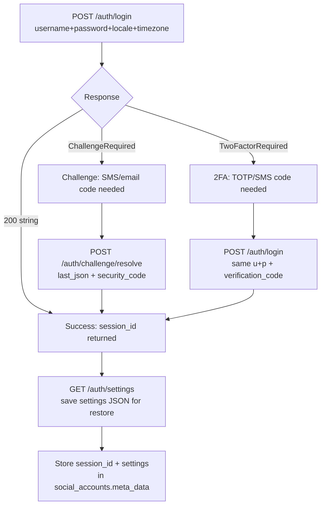

# Instagram Ops

Consolidated skill — each section below was a standalone skill. Member scripts/templates live under `<source-skill>/` inside this directory.

| Section | Source |
|---|---|
| Instagram Account Configuration | `instagram-ops` → `instagram-account-config/` |
| Instagram Personal Account Reconnect | `instagram-ops` → `instagram-personal-reconnect/` |
| Instagram Publishing & Private API | `instagram-private-api` → `instagram-private-api/` |
| Instagram Profile Manager | `instagram-ops` → `instagram-profile-manager/` |
| Instagram Token Reconnect | `instagram-ops` → `instagram-token-reconnect/` |
| Instagram DM (Messaging API) | `instagram-ops` |

## Instagram Account Configuration

### Overview

This skill provides the complete workflow for configuring Instagram accounts
through the SocialAuto stack. It solves three key problems:

1. **Instagram's `__coig_login` redirect** — Direct navigation to
   `/accounts/edit/` triggers a session invalidation guard. The browser
   bridge uses **natural navigation** (profile page → click "Edit profile")
   to bypass this.
2. **Stylish bio generation** — Instagram doesn't support fonts natively,
   but Unicode mathematical characters (Sans Bold, Italic, Small Caps)
   render as styled text. The bio generator creates SEO-optimized bios
   with aesthetic dividers and arrow CTAs.
3. **Optimal settings checklist** — Based on 2025 Instagram optimization
   research: 2FA with authenticator app, activity status off, story
   sharing controls, comment filters, tag approval, and more.

### Architecture

```
User → VNC (port 6080) → browser-novnc (port 9223) → Instagram
                           ↑
                           ├── /session/start    — open browser for platform
                           ├── /session/navigate — navigate to URL
                           ├── /session/evaluate — run JS in page
                           ├── /session/fill     — fill form fields
                           ├── /session/click    — click elements
                           ├── /profile/instagram (GET)  — read profile
                           └── /profile/instagram (PATCH) — update profile
                                                      ↑
                                                      uses natural navigation
```

### Prerequisites

1. **Docker Compose stack running** — `docker compose ps` shows
   `browser-novnc` and `instagram-private-api` containers healthy.
2. **VNC access** — `http://localhost:6080/vnc.html` opens the noVNC viewer.
3. **Facebook-linked Instagram account** — Login via "Log in with Facebook"
   button (avoids password login throttling for Facebook-linked accounts).

### Step-by-step workflow

#### Step 1: Start a browser session

```bash
## Stop any existing session
curl -s -X POST http://localhost:9223/session/stop

## Start a new Instagram browser session
curl -s -X POST http://localhost:9223/session/start \
  -H 'Content-Type: application/json' \
  -d '{"platform":"instagram"}' | python3 -m json.tool
```

#### Step 2: Login via VNC

1. Open `http://localhost:6080/vnc.html` in your browser.
2. On the Instagram login page, click **"Log in with Facebook"**.
3. If multiple accounts appear, select the correct one.
4. Wait until you see the Instagram feed.
5. Verify the logged-in account:

```bash
curl -s -X POST http://localhost:9223/session/navigate \
  -H 'Content-Type: application/json' \
  -d '{"url":"https://www.instagram.com/"}' | python3 -m json.tool

curl -s -X POST http://localhost:9223/session/evaluate \
  -H 'Content-Type: application/json' \
  -d '{"expression":"document.body.innerText.substring(0, 100)"}' | \
  python3 -c "import sys,json; print(json.load(sys.stdin).get('result',''))"
```

#### Step 3: Generate a stylish bio

```bash
## Inside the social-api container
docker compose exec -T social-api python /app/app/scripts/instagram_bio_generator.py \
  --name "Cloudless" \
  --title "Founder @ " \
  --skills "Cloud Architect · Azure · AWS" \
  --experience "15+ yrs building systems" \
  --location "Athens" \
  --links "cloudless.gr | baltzakisthemis.com" \
  --style bold-brand

## List all styles
docker compose exec -T social-api python /app/app/scripts/instagram_bio_generator.py --list-styles

## Check a bio for SEO/NLP
docker compose exec -T social-api python /app/app/scripts/instagram_bio_generator.py \
  --check "🚀 Founder @ Cloudless..."
```

#### Step 4: Update the profile

```bash
## Using the profile update script (recommended)
docker compose exec -T social-api python /app/app/scripts/instagram_profile_update.py \
  --bio "🚀 Founder @ 𝗖𝗹𝗼𝘂𝗱𝗹𝗲𝘀𝘀
☁️ Cloud Architect · Azure · AWS
💡 15+ yrs building systems
📍 Athens → Worldwide
↓ cloudless.gr | baltzakisthemis.com"

## Or using curl directly
curl -s -X PATCH http://localhost:9223/profile/instagram \
  -H 'Content-Type: application/json' \
  -d '{"biography":"🚀 Founder @ Cloudless\n☁️ Cloud Architect · Azure · AWS"}' | \
  python3 -m json.tool
```

#### Step 5: Verify the update

```bash
## Read the profile back
docker compose exec -T social-api python /app/app/scripts/instagram_profile_update.py --read

## Verify a specific bio text was saved
docker compose exec -T social-api python /app/app/scripts/instagram_profile_update.py \
  --verify-bio "Founder"
```

#### Step 6: Apply optimal settings

```bash
## Print the settings checklist
docker compose exec -T social-api python /app/app/scripts/instagram_settings_checklist.py --list

## Check current settings via browser
docker compose exec -T social-api python /app/app/scripts/instagram_settings_checklist.py --check
```

Settings that require manual VNC action (Instagram doesn't expose these via API):

| Setting | Action | Priority |
|---------|--------|----------|
| 2FA | Settings → Accounts Center → 2FA → Authenticator App | CRITICAL |
| Activity Status | Settings → How you use Instagram → Activity Status → OFF | MEDIUM |
| Story Sharing | Settings → Story and reels → Sharing → OFF | MEDIUM |
| Comment Filter | Settings → Comments → Hide offensive comments → ON | MEDIUM |
| Tag Approval | Settings → Tags and mentions → Manual approval | MEDIUM |

#### Step 7: Register in SocialAuto

```bash
## Register the account in the SocialAuto database
docker compose exec -T social-api python -c "
import asyncio
from sqlalchemy import text
from app.db.session import get_db
import uuid

async def register():
    async for db in get_db():
        result = await db.execute(text(
            \"SELECT id FROM social_accounts WHERE platform='instagram' AND username='USERNAME'\"
        ))
        if result.fetchone():
            print('Already registered')
            return
        result = await db.execute(text('SELECT id FROM teams LIMIT 1'))
        team = result.fetchone()
        if not team:
            print('No team found')
            return
        await db.execute(text(
            \"INSERT INTO social_accounts (id, team_id, platform, account_id, username, \"
            \"display_name, account_type, is_business, access_token_enc, refresh_token_enc, \"
            \"token_expires_at, scopes, status, meta_data, created_at, updated_at) \"
            \"VALUES (:id, :team_id, 'instagram', :account_id, 'USERNAME', 'Display Name', \"
            \"'personal', false, 'browser-session', '', NULL, '{}', 'active', \"
            "'{\\\"auth_method\\\": \\\"facebook_linked\\\", \\\"requires_vnc\\\": true}', NOW(), NOW())\"
        ), {'id': str(uuid.uuid4()), 'team_id': team[0], 'account_id': 'USERNAME'})
        await db.commit()
        print('Registered')
        break

asyncio.run(register())
"
```

### Bio style templates

| Style | Description | Best for |
|-------|-------------|----------|
| `bold-brand` | Brand name in Sans Bold Unicode | Personal branding |
| `small-caps` | Brand name in Small Caps | Minimalist aesthetic |
| `italic-tagline` | Italic tagline | Creative professionals |
| `aesthetic-divider` | Star divider line | Artistic accounts |
| `clean-arrows` | Plain text with arrows | Maximum readability |
| `minimal-bullets` | Bullet points | Service listings |

### Key constraints

- **Bio limit**: 150 characters (including emojis, line breaks, invisible chars)
- **Bio lines**: 5 lines maximum (Instagram renders max 5)
- **Name field**: Keep plain text for searchability (no Unicode fonts)
- **Website field**: Only available for business/creator accounts (disabled for personal)
- **Session lifetime**: Instagram sessions last ~1 week; re-login via VNC when expired
- **Rate limit**: 30 requests/min via WARP proxy; backoff after 429s

### Troubleshooting

#### `__coig_login` redirect

**Cause**: Direct navigation to `/accounts/edit/` triggers Instagram's
session guard.

**Fix**: The browser bridge now uses natural navigation (profile page →
click "Edit profile"). If you still see this error, the session is stale —
re-login via VNC.

#### Form submit doesn't persist

**Cause**: React state not updated by JavaScript value assignment.

**Fix**: Use Playwright's `fill()` method (via `/session/fill` endpoint),
which dispatches proper React-compatible events. The `update_instagram_profile`
endpoint in browser-bridge.py handles this correctly.

#### `LoginRequired` from instagrapi

**Cause**: The sessionid was extracted from a different IP context than
the instagrapi client.

**Fix**: Use the browser bridge (same IP as the VNC session) instead of
instagrapi for profile updates. instagrapi is for publishing, not profile
editing.

#### Website field disabled

**Cause**: Personal accounts don't have the website field. Only business
and creator accounts do.

**Fix**: Include URLs in the bio text instead. Use `↓ cloudless.gr` format
with a downward arrow (proven to increase CTR per 2025 research).

#### "Editing your links is only available on mobile" — verified 2026-09-25

Professional accounts see this message on web Edit Profile — it is a
**server-side feature gate**, not just hidden UI. Verified on cloudless.gr:

- Mobile-UA + touch Playwright context still gets the desktop message —
  there is no separate mobile-web edit UI; "mobile" means the mobile APP.
- `POST /api/v1/web/accounts/edit/` returns `{"status":"ok"}` and accepts
  `external_url` / `bio_links`, but the server **silently drops the URL**
  (stores a title-only, non-clickable entry) — `web_profile_info` still
  shows `external_url: ""`, `bio_links: []`.
- `https://i.instagram.com/api/v1/accounts/update_bio_links/` (the mobile
  app endpoint) returns `403 login_required logout_reason:8` with a web
  sessionid — even with a correct `Bearer IGT:2:` token, Android headers,
  and `signed_body`. Web sessionids do not auth the mobile API surface.
- Fresh password login to the private API is blocked by Instagram's
  "app version outdated" checkpoint, so no mobile session can be minted.
- **The web edit endpoint overwrites omitted fields** — a partial POST
  wiped the bio once. Always send the complete field set
  (`username`, `first_name`, `biography`, `gender`, `chaining_enabled`,
  `bio_links` to preserve/clear links).
- Result: adding the website link **requires the phone app** (Edit
  profile → Links). Session transplant into a standalone Playwright
  context works though: export `twitter_storage_state.json` via
  `/session/extract` (contains all origins incl. IG one-tap data), create
  a context with it, navigate to instagram.com, click the saved-profile
  card (`text="cloudless.gr"`) → logged in. Useful for bio/name reads
  without fighting bridge contention.

### Tool scripts

| Script | Location | Purpose |
|--------|----------|---------|
| `instagram_profile_update.py` | `app/scripts/` | Update bio, name, website via browser bridge |
| `instagram_bio_generator.py` | `app/scripts/` | Generate stylish SEO bios with Unicode fonts |
| `instagram_settings_checklist.py` | `app/scripts/` | Check and list optimal account settings |
| `update-bio.py` | `scripts/` | Quick bio update via sidecar (instagrapi) |
| `login-by-sessionid.py` | `scripts/` | Login to sidecar with sessionid |
| `login-via-facebook.py` | `scripts/` | Full Facebook login flow via VNC |

## Instagram Personal Account Reconnect

Reconnect Instagram personal accounts that have invalid or missing OAuth
tokens by using the instagrapi private mobile API sidecar. This bypasses
the need for Meta App Review (which is required for the Graph API path)
and works for personal, creator, and business accounts.

### When to use

- Instagram personal account has `Invalid Fernet token` or decryption
  failure when the token refresh task runs
- The account was restored from D1 backup with a corrupted/missing token
- The Graph API OAuth flow doesn't cover personal accounts (it stores a
  Facebook User Access Token, not an Instagram token)
- You need the account working for the Instagram DM polling task
- You want to use the private API for publishing (not just messaging)

### Architecture

```
SocialAuto API                instagrapi sidecar
     │                              │
     ├─ get-credentials.py ────────▶│ (reads from secret store)
     │                              │
     ├─ login.py ──────────────────▶│ POST /auth/login
     │  (username + password)       │ → session_id
     │                              │
     ├─ handle-2fa.py ─────────────▶│ POST /auth/login
     │  (if 2FA required)           │  + verification_code
     │                              │
     ├─ handle-challenge.py ───────▶│ POST /auth/challenge/resolve
     │  (if challenge required)     │  + security_code
     │                              │
     ├─ save-session.py ──────────▶│ GET /auth/settings
     │  (persist to SocialAuto)    │ → settings JSON
     │                              │
     └─ verify.py ────────────────▶│ GET /auth/profile
                                    │ → account info
```

The instagrapi sidecar runs at `http://localhost:8011` (host) or
`http://instagram-private-api:8000` (Docker internal). It uses the
`instagrapi` Python library to simulate the Instagram mobile app API.

### Prerequisites

- Instagram credentials stored in SocialAuto's secret store
- The `instagram-private-api` container running and healthy
- Cloudflare WARP proxy configured (recommended to avoid IP blocks)

### Full automated flow

```bash
## Run the complete reconnect flow
python3 scripts/reconnect.py <account_id>
```

This will:
1. Check the sidecar health
2. Retrieve Instagram credentials from the secret store
3. Attempt login via the sidecar
4. Handle 2FA or challenge if required (prompts for code)
5. Save the session to SocialAuto
6. Verify the session is active

### Individual scripts

#### Check sidecar health

```bash
python3 scripts/check-sidecar.py
```

Returns exit code 0 if the sidecar is healthy and running.

#### Get stored credentials

```bash
python3 scripts/get-credentials.py <account_id>
```

Retrieves the Instagram username and password from SocialAuto's secret
store. Does not print the password to stdout (uses a temp file).

#### Login via sidecar

```bash
python3 scripts/login.py <account_id>
```

Attempts to log in using the stored credentials. Returns:
- `session_id` on success
- `challenge_required` if a security code is needed
- `two_factor_required` if 2FA is needed

#### Handle 2FA

```bash
python3 scripts/handle-2fa.py <account_id> <verification_code>
```

Completes 2FA login with a TOTP or SMS code.

#### Handle challenge

```bash
python3 scripts/handle-challenge.py <session_id> <last_json> <security_code>
```

Resolves a challenge (SMS/email verification) with a security code.

#### Save session to SocialAuto

```bash
python3 scripts/save-session.py <account_id> <session_id>
```

Saves the session_id and settings JSON to the account's `meta_data` in
the SocialAuto database so it persists across restarts.

#### Verify session

```bash
python3 scripts/verify.py <account_id>
```

Checks if the saved session is active by calling the sidecar's profile
endpoint.

### Session persistence

After a successful login:
1. The sidecar stores the session in `/data/db.json` (persisted via
   the `instagram_sessions` Docker volume)
2. SocialAuto saves `session_id` and `settings` JSON in
   `social_accounts.meta_data.private_api_session_id` and
   `social_accounts.meta_data.private_api_settings`
3. On restart, the session can be restored without re-entering the
   password using `PATCH /auth/settings`

### Sessionid import (alternative to password login)

If the password login fails with `UnknownError` and a Greek message about
"updating the app", Instagram is rejecting the instagrapi API version.
Use the sessionid import instead:

1. Get the `sessionid` cookie from a logged-in Instagram browser session
   (Playwright MCP or browser-novnc)
2. Import it into the sidecar:

```bash
python3 scripts/import-sessionid.py <account_id> <sessionid>
```

This bypasses the password login entirely and uses the existing browser
session. The sessionid can be extracted from:
- Playwright MCP: `document.cookie` on instagram.com
- browser-novnc: `GET /session/cookies` on the bridge (port 9223)
- Chrome DevTools: Application → Cookies → instagram.com → sessionid

### Important notes

- Instagram aggressively blocks datacenter IPs. The Cloudflare WARP
  proxy (`socks5://warp-proxy:1080`) is used by default.
- The `challenge_required` error means Instagram sent a security code
  via SMS or email. The account owner must provide that code.
- The `two_factor_required` error means 2FA is enabled. The user must
  provide a TOTP or SMS code.
- **Password login may fail** with `UnknownError` if the instagrapi
  library version doesn't match Instagram's current API version. Use
  the sessionid import as a fallback.
- Sessions stored in the sidecar persist across container restarts.
- Never log or commit session IDs, settings JSON, or passwords.

### Related skills

- `instagram-private-api` — Full instagrapi sidecar documentation
- `instagram-ops` — OAuth reconnection for Business accounts
- `instagram-ops` — Account configuration and bio updates
- `social-accounts-manager` — Account management via SocialAuto API

## Instagram Publishing & Private API

### Overview

Instagram publishing in SocialAuto uses a **four-tier fallback chain**
(first success wins, in `app/services/publishing.py` → `_publish_instagram`):

1. **instagrapi** (`app/services/instagrapi_client.py`) — **PRIMARY**. Direct
   Python private mobile API using `instagrapi` library. Requires
   `INSTAGRAM_USERNAME` and `INSTAGRAM_PASSWORD` env vars. Works for any
   account type (personal, creator, business) without Meta App Review.
   Session is cached as JSON on the uploads volume
   (`/app/uploads/.instagrapi/{username}.json`) with a 6-day TTL.
   Supports single photos, videos, and carousels up to 10.
   All blocking calls are dispatched via `asyncio.to_thread`.
2. **Web API (rupload_igphoto)** — fallback. Uses browser `sessionid`
   cookie directly against `www.instagram.com`. Supports single photos
   and carousels (up to 10 images). Sessions are short-lived and may be
   invalidated after API use.
3. **Sidecar (aiograpi-rest)** — fallback for video uploads or when web
   API session is unavailable. Uses the private mobile API (`i.instagram.com`).
4. **Graph API** — last resort. Requires Meta App Review for
   `instagram_content_publish` permission.

### instagrapi publishing (PRIMARY)

#### How it works

The `InstagrapiClient` in `app/services/instagrapi_client.py` wraps the
`instagrapi` Python library:

1. Creates a `Client()` with optional proxy (`INSTAGRAM_PROXY` env var,
   defaults to `socks5://warp-proxy:1080`).
2. Logs in with username/password and caches the session as JSON.
3. On subsequent calls, loads the cached session instead of re-logging in.
4. Session auto-refreshes after 6 days (well before IG's ~90-day limit).

#### Required env vars

- `INSTAGRAM_USERNAME` — Instagram account username
- `INSTAGRAM_PASSWORD` — Instagram account password
- `INSTAGRAM_PROXY` (optional) — SOCKS5/HTTP proxy URL

#### Supported operations

- `upload_photo(path, caption)` — single photo post
- `upload_video(path, caption)` — single video post
- `upload_album(media_paths[:10], caption)` — carousel (up to 10 items)

### Web API publishing (FALLBACK)

#### How it works

The web API path replicates what the Instagram web app does when you post:
1. Upload photo bytes via `POST https://www.instagram.com/rupload_igphoto/{entity}`
2. Configure the post via `POST https://www.instagram.com/create/configure/`
   (single photo) or `POST https://www.instagram.com/create/configure_sidecar/`
   (carousel)

#### Required session cookies

Stored in `social_accounts.meta_data`:
- `private_api_session_id` — the `sessionid` cookie from instagram.com
- `private_api_csrf_token` — the `csrftoken` cookie
- `private_api_ds_user_id` — the `ds_user_id` cookie

#### Setting the session via API

```bash
## Set the web session cookies
curl -X POST http://localhost:8083/api/v1/profile/instagram/web-session \
  -H "Content-Type: application/json" \
  -d '{"sessionid":"<SID>","csrftoken":"<CSRF>","ds_user_id":"<DS_USER_ID>"}'

## Check if the session is valid
curl http://localhost:8083/api/v1/profile/instagram/web-session
```

#### Getting the cookies from a browser

1. Open https://www.instagram.com in Chrome/Firefox (log in if needed)
2. Open DevTools → Application → Cookies → instagram.com
3. Copy the values of `sessionid`, `csrftoken`, and `ds_user_id`

#### Session lifecycle

Instagram **invalidates the browser sessionid after each API upload**.
This means you need a fresh sessionid for each publishing session. The
session can be refreshed by:
- Re-exporting cookies from the browser after each post
- Using the `POST /api/v1/profile/instagram/web-session` endpoint to update

#### Code path

```
_publish_instagram()
  → _publish_instagram_via_web()     # PRIMARY: rupload_igphoto
  → _publish_instagram_via_sidecar() # FALLBACK: private mobile API
  → _publish_instagram_via_graph()   # LAST RESORT: Graph API
```

### Sidecar endpoint (fallback)

```
http://localhost:8011   (host port)
http://instagram-private-api:8000  (internal Docker network)
```

### Sidecar endpoint

```
http://localhost:8011   (host port)
http://instagram-private-api:8000  (internal Docker network)
```

### Authentication model

The sidecar uses `X-Session-ID` header for all authenticated calls.
Sessions are stored in a TinyDB JSON file at `/data/db.json` inside the
container, persisted via the `instagram_sessions` Docker volume.

### Login flow



### Key parameters for reducing challenge risk

| Parameter | Default | Purpose |
|-----------|---------|---------|
| `locale` | `el_GR` | Match the account owner's language |
| `timezone` | `10800` | UTC+3 (Athens) in seconds |
| `proxy` | (none) | Mobile/residential proxy URL to avoid datacenter IP blocks |

### Session persistence

After a successful login:
1. The sidecar stores the session in `/data/db.json` automatically.
2. The SocialAuto backend saves `session_id` and `settings` JSON in
   `social_accounts.meta_data` for cross-restart restore.
3. To restore without password: `PATCH /auth/settings` with the saved
   settings JSON.

### Scripts

```bash
## Check sidecar health
.devin/skills/instagram-ops/instagram-private-api/scripts/health.py

## Login with username/password (reads from secret store)
.devin/skills/instagram-ops/instagram-private-api/scripts/login.py

## Login with 2FA verification code
.devin/skills/instagram-ops/instagram-private-api/scripts/login-2fa.py <code>

## Resolve a challenge with a security code
.devin/skills/instagram-ops/instagram-private-api/scripts/challenge-resolve.py <session_id> <last_json> <code>

## Import an existing sessionid cookie
.devin/skills/instagram-ops/instagram-private-api/scripts/import-session.py <sessionid>

## Save settings for session restore
.devin/skills/instagram-ops/instagram-private-api/scripts/save-settings.py <session_id>

## Restore session from saved settings
.devin/skills/instagram-ops/instagram-private-api/scripts/restore-session.py <settings_json_file>

## Get current account profile
.devin/skills/instagram-ops/instagram-private-api/scripts/get-profile.py <session_id>

## Update biography
.devin/skills/instagram-ops/instagram-private-api/scripts/update-bio.py <session_id> "new bio text"

## Update profile picture
.devin/skills/instagram-ops/instagram-private-api/scripts/update-picture.py <session_id> <image_file>
```

### Important notes

- **Web API sessionid is invalidated after each upload.** Plan to refresh
  the session before each publishing session.
- Instagram aggressively blocks datacenter IPs. A mobile or residential
  proxy is strongly recommended for reliable sidecar login.
- The `challenge_required` error means Instagram sent a security code
  via SMS or email. The account owner must provide that code.
- The `two_factor_required` error means 2FA is enabled. The user must
  provide a TOTP or SMS code.
- Sessions stored in the sidecar's `/data/db.json` persist across
  container restarts via the `instagram_sessions` Docker volume.
- Settings JSON saved in `social_accounts.meta_data` allows session
  restore without re-entering the password.
- Never log or commit session IDs, settings JSON, or passwords.
- **Graph API** requires Meta App Review for `instagram_content_publish`.
  In development mode, only app admins/testers can publish. The app
  `1936126137016578` is currently in development mode.

### Known dead ends (verified 2026-09-28)

- **`needs_upgrade` ("Your version of Instagram is out of date")** blocks
  password login on instagrapi 2.18.x AND aiograpi 2.0.11/2.0.13 — both
  `login()` (CAA path) and `login_by_sessionid`. Upstream fix
  (instagrapi ≥3.0.9 / aiograpi ≥2.0.8 CAA retry) did NOT unblock this
  account — the block is credential/IP-level at Instagram's edge, not
  library-version-level. Do not burn cycles on library bumps alone.
- **Web `sessionid` ≠ mobile session.** `login_by_sessionid` accepts a
  `sessionid` cookie lifted from instagram.com but the resulting session
  fails on every private call (`login_required`). Instagram no longer
  honors web sessionids on the private mobile API.
- **`POST /api/v1/media/{id}/delete/` is not the web delete endpoint**
  (returns 200 + HTML, deletes nothing). There is no Graph API media
  delete. Working path: browser UI — post page → `⋯` More options →
  Delete → confirm; a successful delete redirects to the profile.

### `media_publish` false-negative (subcode 2207051)

Meta returns `403 code 4 subcode 2207051` ("Application request limit
reached") **after** the post already went live server-side. Retrying
publishes duplicates (one post landed 6 copies before the fix).
`publishing.py` now: pre-checks recent media before publishing, waits
~4s after any `InstagramAPIError`/`TimeoutError`, then verifies the feed
via `InstagramAPIClient.list_recent_media()` and returns success with
the real media id/permalink when the post is live. Never retry a
`media_publish` failure without this feed check.

### Session-of-record: the browser bridge

The shared browser bridge (9223) holds a logged-in `cloudless.gr` web
session (restored via Accounts-Center "Continue as" — no password
needed). It is the reliable session for profile edits, post deletion,
and any flow the private API cannot do. `GET /session/cookies` extracts
`sessionid`/`csrftoken`/`ds_user_id`. Tag requests with the current
`busy_owner` platform or they 409 while another platform's poller holds
the browser.

## Instagram Profile Manager

Manage Instagram business/creator profile metadata through the aiograpi-rest sidecar:
biography, external URL, profile picture, name, and account info.

### When to use

- Update Instagram bio text
- Update Instagram profile picture
- Set/change external URL in bio
- Read current profile info (username, bio, follower count, etc.)
- Login via saved sessionid or username/password

### Sidecar

```
http://localhost:8011   (host port)
http://instagram-private-api:8000  (internal Docker network)
```

### Authentication

All authenticated endpoints require an `X-Session-ID` header.
Sessions are stored in `/data/db.json` inside the container (persisted via Docker volume).

#### Login methods

1. **By sessionid** (preferred — no 2FA, no password): `POST /auth/login/by/sessionid`
2. **By username/password**: `POST /auth/login` (may trigger 2FA or challenge)
3. **Restore from saved settings**: `PATCH /auth/relogin`

#### Finding a saved sessionid

The sidecar stores sessions in `/data/db.json`. Each session has a `sessionid` field.
To list available sessions:

```bash
.devin/skills/instagram-ops/instagram-profile-manager/scripts/list-sessions.py
```

### Key endpoints

| Method | Path | Purpose |
|--------|------|---------|
| POST | `/auth/login/by/sessionid` | Login with a sessionid cookie |
| POST | `/auth/login` | Login with username/password |
| PATCH | `/auth/relogin` | Refresh current session |
| GET | `/account` | Get authenticated account info |
| PATCH | `/account` | Update profile (full_name, biography, external_url, phone_number, email) |
| PATCH | `/account/biography` | Update biography text only |
| PATCH | `/account/external-url` | Set website URL in bio |
| DELETE | `/account/external-url` | Remove website URL from bio |
| PATCH | `/account/picture` | Update profile picture (multipart file upload) |
| GET | `/user?username=...` | Get any user's profile (public) |

### Tool scripts

Run from repo root `cu130-slim/`:

```bash
## List saved sessions in the sidecar
.devin/skills/instagram-ops/instagram-profile-manager/scripts/list-sessions.py

## Login using a sessionid
.devin/skills/instagram-ops/instagram-profile-manager/scripts/login-by-sessionid.py <sessionid>

## Login using username and password
.devin/skills/instagram-ops/instagram-profile-manager/scripts/login.py [username] [password]

## Get current account info
.devin/skills/instagram-ops/instagram-profile-manager/scripts/get-account.py [session_id]

## Update biography
.devin/skills/instagram-ops/instagram-profile-manager/scripts/update-bio.py [session_id] "new bio text"

## Update external URL
.devin/skills/instagram-ops/instagram-profile-manager/scripts/update-url.py [session_id] "https://example.com"

## Update profile picture
.devin/skills/instagram-ops/instagram-profile-manager/scripts/update-picture.py [session_id] <image_file>

## Get any user's profile
.devin/skills/instagram-ops/instagram-profile-manager/scripts/get-user.py [session_id] <username>
```

### Instagram bio limits

- **150 characters** max (emojis count as 2 chars each in Instagram's count)
- Newlines supported (`\n`)
- No clickable links in bio text — use the external URL field instead

### Important notes

- The sessionid is httpOnly and cannot be retrieved via browser JS.
- To get a fresh sessionid: log in via browser, then extract cookies from the
  browser context (not document.cookie).
- Sessions expire after ~90 days. The sidecar auto-refreshes after 6 days.
- Instagram aggressively blocks datacenter IPs. Use WARP proxy
  (`socks5://warp-proxy:1080`) for login attempts.
- Never log or commit session IDs, settings JSON, or passwords.

### Session recovery procedure (when all sessions are expired)

When the sidecar's saved sessions are expired and username/password login
gets 429 (rate limited) or "login with Facebook" error, follow this order:

1. **Get a fresh sessionid from a real browser** (most reliable):
   - Open https://www.instagram.com in Chrome/Firefox and log in manually.
   - Open DevTools → Application → Cookies → instagram.com.
   - Copy the `sessionid` cookie value.
   - Import it: `.devin/skills/instagram-ops/instagram-private-api/scripts/import-session.py <sessionid>`
   - Verify: `.devin/skills/instagram-ops/instagram-private-api/scripts/get-profile.py <new_session_id>`

2. **If username/password login is rate-limited (429)**:
   - Wait 24-48h for the rate limit to clear.
   - Retry with WARP proxy: `INSTAGRAM_PROXY=socks5://warp-proxy:1080`
   - The sidecar login script passes the proxy to avoid datacenter IP blocks.

3. **If Facebook SSO has a redirect loop**:
   - The profile picker page (`Continue as X`) causes a redirect loop.
   - Use the FB sidecar's `GET /session/validate` to confirm the picker is shown.
   - Alternative: use the FB sidecar's `/debug/all-cookies` endpoint to extract
     Instagram cookies from an authenticated FB session that has already
     authorized Instagram.

4. **Automated health check**:
   - A Celery beat task (`check-instagram-sessions`) runs every 6 hours.
   - It calls `GET /account` on the sidecar with each saved `X-Session-ID`.
   - If a session is expired, the account is marked `expired` and the team
     owner gets an alert email (24h cooldown to avoid spam).
   - Check task status: `docker compose exec -T social-worker-default celery -A
     app.worker.celery_app inspect active | grep instagram`

## Instagram Token Reconnect

Reconnect Instagram accounts with expired, invalid, or missing access tokens
through the SocialAuto OAuth flow. Detects invalid Fernet-encrypted tokens,
triggers the OAuth reconnection, and verifies the new token works.

### When to use

- Instagram polling task reports `binascii.Error: Incorrect padding` or
  `cryptography.fernet.InvalidToken`
- Instagram token refresh task reports `tokens_invalid: 1` or `errors: 1`
- Instagram Business account returns `(#3) Application does not have the
  capability to make this API call`
- Instagram Personal account token is missing or malformed
- Instagram DM bot can't read/send messages due to auth errors
- After Meta App Review grants `instagram_business_manage_messages`

### Token lifecycle

```
OAuth login → short-lived token (1 hour)
    ↓
Exchange for long-lived token (60 days)
    ↓
Auto-refresh every 7 days (instagram_token_refresh task)
    ↓
Token expires after 60 days if not refreshed
    ↓
Reconnect via OAuth (this skill)
```

### Common token errors

| Error | Cause | Fix |
|-------|-------|-----|
| `binascii.Error: Incorrect padding` | Token not properly Fernet-encrypted in DB | Reconnect via OAuth |
| `cryptography.fernet.InvalidToken` | Decrypted value is not a valid token | Reconnect via OAuth |
| `(#3) Application does not have the capability` | Missing `instagram_business_manage_messages` permission | Submit for App Review |
| `(#190) Invalid OAuth access token` | Token expired or revoked | Reconnect via OAuth |
| `(#10) Permission denied` | App not approved for the permission | Submit for App Review |

### Reconnection flow

#### Step 1: Check token status

```bash
python3 scripts/check-token-status.py
```

Returns per-account status:
- `instagram_token_status`: valid, expired, invalid, refresh_failed
- `instagram_token_error`: error details
- `instagram_token_expires_at`: expiry timestamp

#### Step 2: Trigger token refresh (if not already invalid)

```bash
## Manually trigger the weekly refresh task
docker compose exec -T social-worker-default celery -A app.worker.celery_app call \
  app.worker.tasks.instagram_token_refresh.refresh_instagram_tokens
```

If the token is valid but nearing expiry, this will refresh it. If the token
is invalid, it will be flagged for reconnection.

#### Step 3: Reconnect via OAuth

For accounts with invalid tokens, the only fix is to re-authenticate via
the Meta OAuth flow:

1. Navigate the browser-novnc to the Instagram OAuth URL:
   ```bash
   python3 scripts/reconnect-oauth.py <account_id>
   ```
2. The user logs in to Instagram via noVNC (port 6080) if not already logged in
3. Grant the required permissions:
   - `instagram_business_basic`
   - `instagram_business_manage_messages` (requires App Review)
   - `instagram_business_content_publishing` (for posting)
4. The callback stores the new encrypted token in SocialAuto
5. Verify the new token works

#### Step 4: Verify the new token

```bash
python3 scripts/check-token-status.py
```

`instagram_token_status` should now show `valid`.

### App Review dependency

The `instagram_business_manage_messages` permission requires Meta App Review
before it works for non-tester accounts. See the `developer-apps-ops` skill for
the submission process.

Until App Review is approved:
- Instagram Business DMs will return `(#3) Application does not have the
  capability`
- Instagram Personal DMs may work if the account is a tester

### Scripts

- `scripts/check-token-status.py` — Check token status for all Instagram accounts
- `scripts/reconnect-oauth.py` — Generate the OAuth URL and open it in the browser bridge
- `scripts/validate-token.py` — Validate a specific account's token via the Graph API

### Related skills

- `developer-apps-ops` — Meta App Review submission for Instagram messaging permissions
- `instagram-ops` — Instagram DM API client
- `instagram-ops` — Instagram account setup
- `social-accounts-manager` — Account management via SocialAuto API

## Instagram DM (Messaging API)

Send and receive Instagram direct messages through the official Instagram
Messaging API. This uses the same Messenger Platform API as Facebook Page
Messenger, accessed via the Instagram Graph API.

### When to use

- Send a direct message to an Instagram user
- Read Instagram DM conversations
- Build an Instagram DM bot or auto-reply
- Mark Instagram conversations as read
- Show typing indicator in Instagram DMs
- Send template messages outside the 24-hour window
- Integrate Instagram DMs into the unified inbox

### Prerequisites

- Instagram Business or Creator account
- Facebook Page connected to the Instagram account (FB-Login path only)
- Meta app with `instagram_manage_messages` (FB Login) or
  `instagram_business_manage_messages` (Instagram Business Login)
- Valid access token with the messaging scope
- The recipient must have messaged the business first (24-hour window)

### Two token flavors — IMPORTANT

There are two mutually incompatible Instagram token types. Using a token
against the wrong host fails with `OAuthException 190 "Cannot parse access
token"` — that error means wrong host, NOT an invalid token.

|                                | FB Login (linked Page)                                    | Instagram Business Login                                            |
| ------------------------------ | --------------------------------------------------------- | ------------------------------------------------------------------- |
| Token scopes                   | `instagram_basic`, `instagram_manage_messages`, `pages_*` | `instagram_business_basic`, `instagram_business_manage_messages`, … |
| API host                       | `graph.facebook.com`                                      | `graph.instagram.com`                                               |
| `account.meta_data.login_type` | (absent)                                                  | `"business_login"`                                                  |
| Client flag                    | `use_business_login_api=False` (default)                  | `use_business_login_api=True`                                       |

Always construct the client from account metadata:

```python
client = InstagramAPIClient(
    access_token=decrypt_token(account.access_token_enc),
    ig_user_id=account.account_id,
    use_business_login_api=(account.meta_data or {}).get("login_type") == "business_login",
)
```

### IGSID vs app-scoped ID — IMPORTANT

On `graph.instagram.com`, `account.account_id` is the **app-scoped** ID
(e.g. `28747382798219804`) but conversation `participants` and message
`from` carry the **IGSID** (e.g. `17841436821573754`). Resolve ours once
per poll:

```python
me = await client.get_me()          # GET /me?fields=id,user_id,username
my_igsid = me["user_id"]            # IGSID — compare sender/participant ids to this
```

- `recipient.id` for `send_dm` / `send_typing_indicator` / `mark_dm_read`
  must be the **other participant's IGSID** — filter `participants` by
  `id not in {my_igsid, account.account_id}`. Blindly taking
  `participants[0]` is a bug: it is often ourselves, and sending to our own
  ID fails with `IGApiException 100 / subcode 2534014` ("cannot find user").
- `GET /me` without `fields` returns only `{id}` (app-scoped) — always pass
  `fields=user_id` (via `client.get_me()`).

### API methods

All methods are on `InstagramAPIClient` in
`social-automation/backend/app/services/instagram_api.py`.

#### send_dm(recipient_id, message)

Send a direct message to an Instagram user. The recipient must have messaged
the business within the last 24 hours.

```python
client = InstagramAPIClient(access_token=token, ig_user_id=ig_id)
result = await client.send_dm(
    recipient_id="17895678901234567",
    message="Thanks for reaching out! How can we help?",
)
```

#### send_dm_template(recipient_id, template_name, language, components)

Send a pre-approved template message. Templates must be pre-approved by Meta.
Used for messages outside the 24-hour window with message tags.

```python
result = await client.send_dm_template(
    recipient_id="17895678901234567",
    template_name="welcome_message",
    language={"code": "en"},
    components=[...],
)
```

#### get_conversations(limit=25)

List recent Instagram DM conversations with the most recent message preview.

```python
result = await client.get_conversations(limit=25)
## Returns: { "data": [ { "id": "...", "participants": {...}, "messages": {...} } ] }
```

#### get_dm_messages(conversation_id, limit=20)

Read messages from a specific Instagram DM conversation.

```python
result = await client.get_dm_messages(conversation_id="123456789", limit=20)
## Returns: { "data": [ { "id": "...", "message": "...", "from": {...} } ] }
```

#### mark_dm_read(conversation_id, recipient_id="")

Mark an Instagram DM conversation as read.

```python
await client.mark_dm_read(conversation_id="...", recipient_id="<IGSID>")
```

`graph.instagram.com` rejects `recipient.thread_key` — always pass
`recipient_id` (the peer's IGSID) so the client sends `recipient.id`.

#### send_typing_indicator(recipient_id)

Show typing indicator in an Instagram DM conversation.

```python
await client.send_typing_indicator(recipient_id="17895678901234567")
```

### API base URL

```
## FB Login (Page-linked) tokens:
https://graph.facebook.com/v26.0/{ig_user_id}/messages
## Instagram Business Login tokens:
https://graph.instagram.com/v26.0/{ig_user_id}/messages   # /me/* also works
```

### Required permission scopes

```
## FB Login:        instagram_basic instagram_manage_messages pages_show_list …
## Business Login:  instagram_business_basic instagram_business_manage_messages …
```

### Live verification

```bash
## All ops, read-only safe (typing + mark_read are no-ops for the user):
docker compose exec -T social-api python - <<'EOF'
import asyncio
from sqlalchemy import select
from app.db.session import async_session_maker
from app.models.social_account import SocialAccount
from app.core.security import decrypt_token
from app.services.instagram_api import InstagramAPIClient

async def main():
    async with async_session_maker() as db:
        a = (await db.execute(select(SocialAccount).where(
            SocialAccount.platform == "instagram"))).scalars().first()
        meta = a.meta_data or {}
        c = InstagramAPIClient(
            access_token=decrypt_token(a.access_token_enc),
            ig_user_id=a.account_id,
            use_business_login_api=meta.get("login_type") == "business_login",
        )
        print("me:", await c.get_me())
        convos = await c.get_conversations(limit=3)
        print("convos:", len(convos.get("data", [])))
asyncio.run(main())
EOF
```

### 24-hour messaging window

The Instagram Messaging API follows the same 24-hour window as Facebook
Page Messenger:

- **Within 24 hours**: Send any message with `messaging_type: RESPONSE`
- **Outside 24 hours**: Must use `messaging_type: MESSAGE_TAG` with an
  approved tag (`ACCOUNT_UPDATE`, `HUMAN_AGENT`, `CONFIRMED_EVENT_UPDATE`)
- **Templates**: Pre-approved by Meta, sent with `MESSAGE_TAG`

### Integration with unified inbox

Instagram DMs are automatically included in the unified inbox:

```bash
curl -s http://localhost:8083/api/v1/inbox/inbox \
  -H "Authorization: Bearer $TOKEN" \
  | python3 -c "import sys,json; d=json.load(syss.stdin); [print(c) for c in d['conversations'] if c['platform']=='instagram']"
```

### Source files

- `social-automation/backend/app/services/instagram_api.py` — InstagramAPIClient with DM methods
- `social-automation/backend/app/api/inbox.py` — Unified inbox integration

### Future enhancements

- Instagram DM webhook handling (receive messages in real-time)
- Instagram DM auto-reply with AI (like Page Messenger auto-reply)
- Instagram DM template management API
- Instagram DM analytics (response time, volume)
