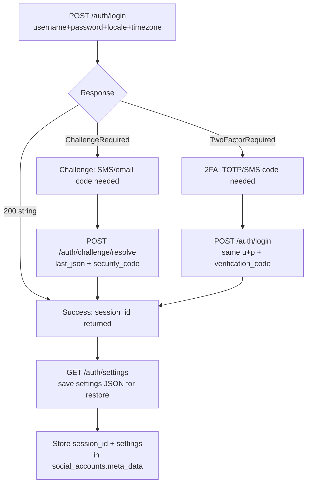

# Instagram Private API (aiograpi-rest sidecar)

## Overview

The `aiograpi-rest` sidecar wraps the `aiograpi` async Instagram private
mobile API as a RESTful HTTP service. It enables profile writes (bio,
picture, name, website, phone, email) that the official Graph API does
not support.

## Sidecar endpoint

```
http://localhost:8011   (host port)
http://instagram-private-api:8000  (internal Docker network)
```

## Authentication model

The sidecar uses `X-Session-ID` header for all authenticated calls.
Sessions are stored in a TinyDB JSON file at `/data/db.json` inside the
container, persisted via the `instagram_sessions` Docker volume.

## Login flow



## Key parameters for reducing challenge risk

| Parameter | Default | Purpose |
|-----------|---------|---------|
| `locale` | `el_GR` | Match the account owner's language |
| `timezone` | `10800` | UTC+3 (Athens) in seconds |
| `proxy` | (none) | Mobile/residential proxy URL to avoid datacenter IP blocks |

## Session persistence

After a successful login:
1. The sidecar stores the session in `/data/db.json` automatically.
2. The SocialAuto backend saves `session_id` and `settings` JSON in
   `social_accounts.meta_data` for cross-restart restore.
3. To restore without password: `PATCH /auth/settings` with the saved
   settings JSON.

## Scripts

```bash
# Check sidecar health
.devin/skills/instagram-private-api/scripts/health.sh

# Login with username/password (reads from secret store)
.devin/skills/instagram-private-api/scripts/login.sh

# Login with 2FA verification code
.devin/skills/instagram-private-api/scripts/login-2fa.sh <code>

# Resolve a challenge with a security code
.devin/skills/instagram-private-api/scripts/challenge-resolve.sh <session_id> <last_json> <code>

# Import an existing sessionid cookie
.devin/skills/instagram-private-api/scripts/import-session.sh <sessionid>

# Save settings for session restore
.devin/skills/instagram-private-api/scripts/save-settings.sh <session_id>

# Restore session from saved settings
.devin/skills/instagram-private-api/scripts/restore-session.sh <settings_json_file>

# Get current account profile
.devin/skills/instagram-private-api/scripts/get-profile.sh <session_id>

# Update biography
.devin/skills/instagram-private-api/scripts/update-bio.sh <session_id> "new bio text"

# Update profile picture
.devin/skills/instagram-private-api/scripts/update-picture.sh <session_id> <image_file>
```

## Important notes

- Instagram aggressively blocks datacenter IPs. A mobile or residential
  proxy is strongly recommended for reliable login.
- The `challenge_required` error means Instagram sent a security code
  via SMS or email. The account owner must provide that code.
- The `two_factor_required` error means 2FA is enabled. The user must
  provide a TOTP or SMS code.
- Sessions stored in the sidecar's `/data/db.json` persist across
  container restarts via the `instagram_sessions` Docker volume.
- Settings JSON saved in `social_accounts.meta_data` allows session
  restore without re-entering the password.
- Never log or commit session IDs, settings JSON, or passwords.
