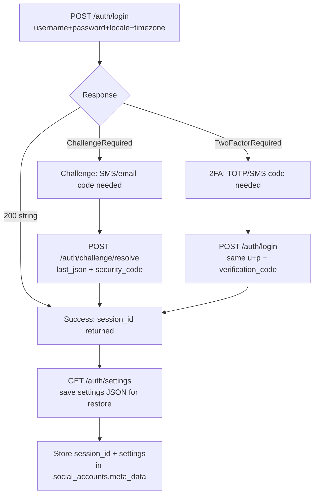

# Instagram Publishing & Private API

## Overview

Instagram publishing in SocialAuto uses a **three-tier fallback chain**:

1. **Web API (rupload_igphoto)** — **PRIMARY**. Uses browser `sessionid`
   cookie directly against `www.instagram.com`. Supports single photos
   and carousels (up to 10 images). Bypasses the private mobile API which
   often rejects browser sessions with `login_required`.
2. **Sidecar (aiograpi-rest)** — fallback for video uploads or when web
   API session is unavailable. Uses the private mobile API (`i.instagram.com`).
3. **Graph API** — last resort. Requires Meta App Review for
   `instagram_content_publish` permission.

## Web API publishing (PRIMARY)

### How it works

The web API path replicates what the Instagram web app does when you post:
1. Upload photo bytes via `POST https://www.instagram.com/rupload_igphoto/{entity}`
2. Configure the post via `POST https://www.instagram.com/create/configure/`
   (single photo) or `POST https://www.instagram.com/create/configure_sidecar/`
   (carousel)

### Required session cookies

Stored in `social_accounts.meta_data`:
- `private_api_session_id` — the `sessionid` cookie from instagram.com
- `private_api_csrf_token` — the `csrftoken` cookie
- `private_api_ds_user_id` — the `ds_user_id` cookie

### Setting the session via API

```bash
# Set the web session cookies
curl -X POST http://localhost:8083/api/v1/profile/instagram/web-session \
  -H "Content-Type: application/json" \
  -d '{"sessionid":"<SID>","csrftoken":"<CSRF>","ds_user_id":"<DS_USER_ID>"}'

# Check if the session is valid
curl http://localhost:8083/api/v1/profile/instagram/web-session
```

### Getting the cookies from a browser

1. Open https://www.instagram.com in Chrome/Firefox (log in if needed)
2. Open DevTools → Application → Cookies → instagram.com
3. Copy the values of `sessionid`, `csrftoken`, and `ds_user_id`

### Session lifecycle

Instagram **invalidates the browser sessionid after each API upload**.
This means you need a fresh sessionid for each publishing session. The
session can be refreshed by:
- Re-exporting cookies from the browser after each post
- Using the `POST /api/v1/profile/instagram/web-session` endpoint to update

### Code path

```
_publish_instagram()
  → _publish_instagram_via_web()     # PRIMARY: rupload_igphoto
  → _publish_instagram_via_sidecar() # FALLBACK: private mobile API
  → _publish_instagram_via_graph()   # LAST RESORT: Graph API
```

## Sidecar endpoint (fallback)

```
http://localhost:8011   (host port)
http://instagram-private-api:8000  (internal Docker network)
```

## Sidecar endpoint

```
http://localhost:8011   (host port)
http://instagram-private-api:8000  (internal Docker network)
```

## Authentication model

The sidecar uses `X-Session-ID` header for all authenticated calls.
Sessions are stored in a TinyDB JSON file at `/data/db.json` inside the
container, persisted via the `instagram_sessions` Docker volume.

## Login flow



## Key parameters for reducing challenge risk

| Parameter | Default | Purpose |
|-----------|---------|---------|
| `locale` | `el_GR` | Match the account owner's language |
| `timezone` | `10800` | UTC+3 (Athens) in seconds |
| `proxy` | (none) | Mobile/residential proxy URL to avoid datacenter IP blocks |

## Session persistence

After a successful login:
1. The sidecar stores the session in `/data/db.json` automatically.
2. The SocialAuto backend saves `session_id` and `settings` JSON in
   `social_accounts.meta_data` for cross-restart restore.
3. To restore without password: `PATCH /auth/settings` with the saved
   settings JSON.

## Scripts

```bash
# Check sidecar health
.devin/skills/instagram-private-api/scripts/health.sh

# Login with username/password (reads from secret store)
.devin/skills/instagram-private-api/scripts/login.sh

# Login with 2FA verification code
.devin/skills/instagram-private-api/scripts/login-2fa.sh <code>

# Resolve a challenge with a security code
.devin/skills/instagram-private-api/scripts/challenge-resolve.sh <session_id> <last_json> <code>

# Import an existing sessionid cookie
.devin/skills/instagram-private-api/scripts/import-session.sh <sessionid>

# Save settings for session restore
.devin/skills/instagram-private-api/scripts/save-settings.sh <session_id>

# Restore session from saved settings
.devin/skills/instagram-private-api/scripts/restore-session.sh <settings_json_file>

# Get current account profile
.devin/skills/instagram-private-api/scripts/get-profile.sh <session_id>

# Update biography
.devin/skills/instagram-private-api/scripts/update-bio.sh <session_id> "new bio text"

# Update profile picture
.devin/skills/instagram-private-api/scripts/update-picture.sh <session_id> <image_file>
```

## Important notes

- **Web API sessionid is invalidated after each upload.** Plan to refresh
  the session before each publishing session.
- Instagram aggressively blocks datacenter IPs. A mobile or residential
  proxy is strongly recommended for reliable sidecar login.
- The `challenge_required` error means Instagram sent a security code
  via SMS or email. The account owner must provide that code.
- The `two_factor_required` error means 2FA is enabled. The user must
  provide a TOTP or SMS code.
- Sessions stored in the sidecar's `/data/db.json` persist across
  container restarts via the `instagram_sessions` Docker volume.
- Settings JSON saved in `social_accounts.meta_data` allows session
  restore without re-entering the password.
- Never log or commit session IDs, settings JSON, or passwords.
- **Graph API** requires Meta App Review for `instagram_content_publish`.
  In development mode, only app admins/testers can publish. The app
  `1936126137016578` is currently in development mode.
