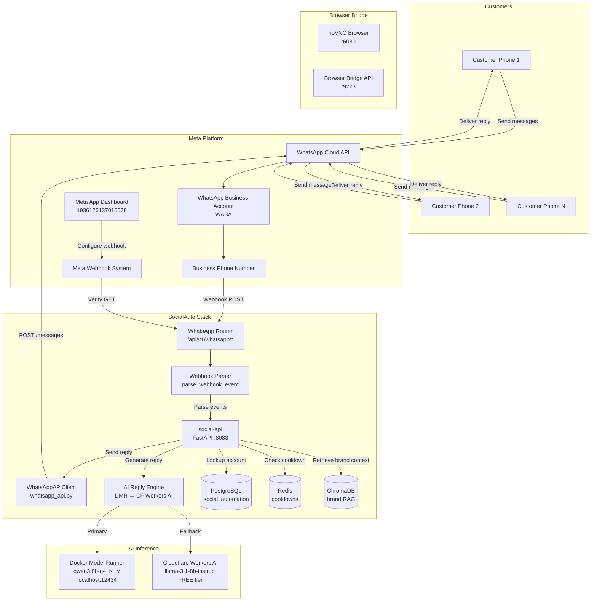
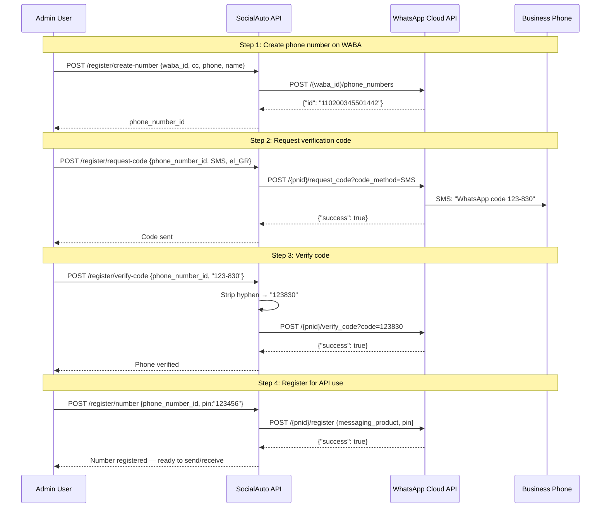
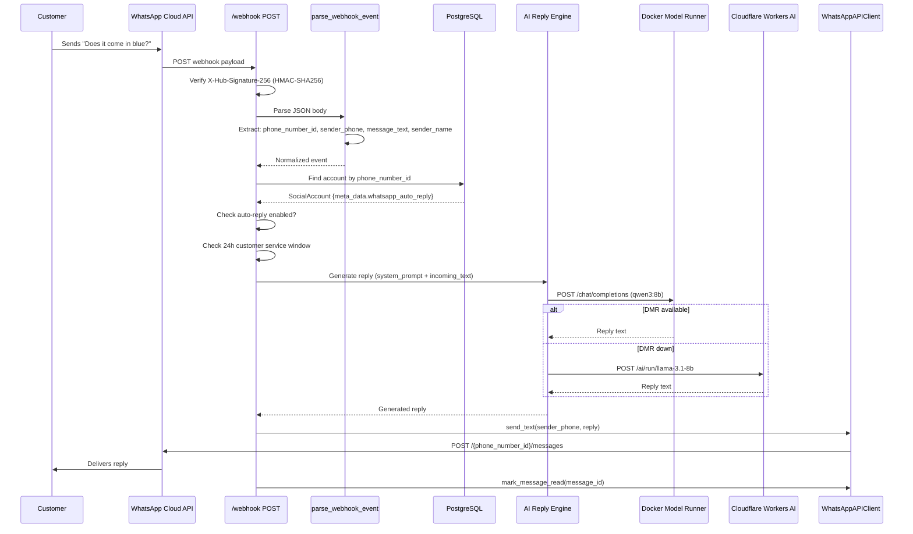
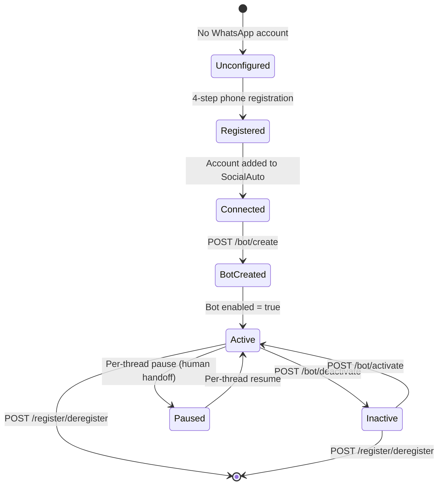
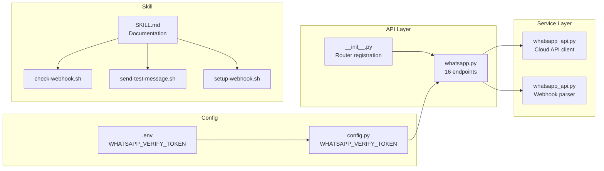
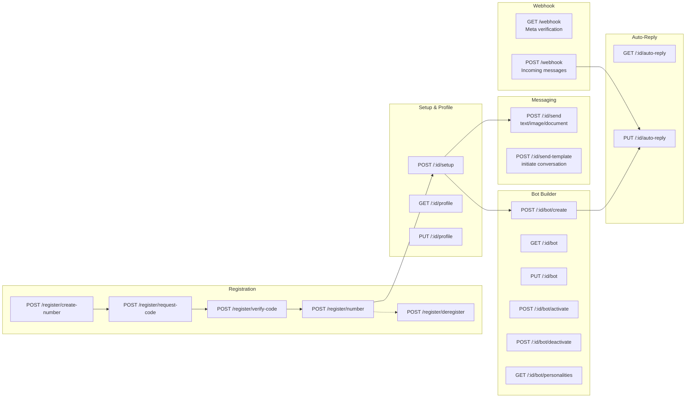
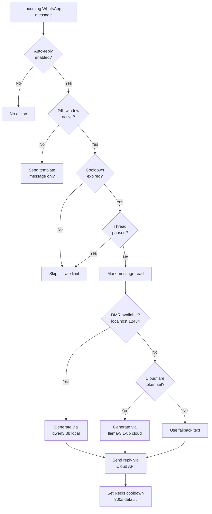
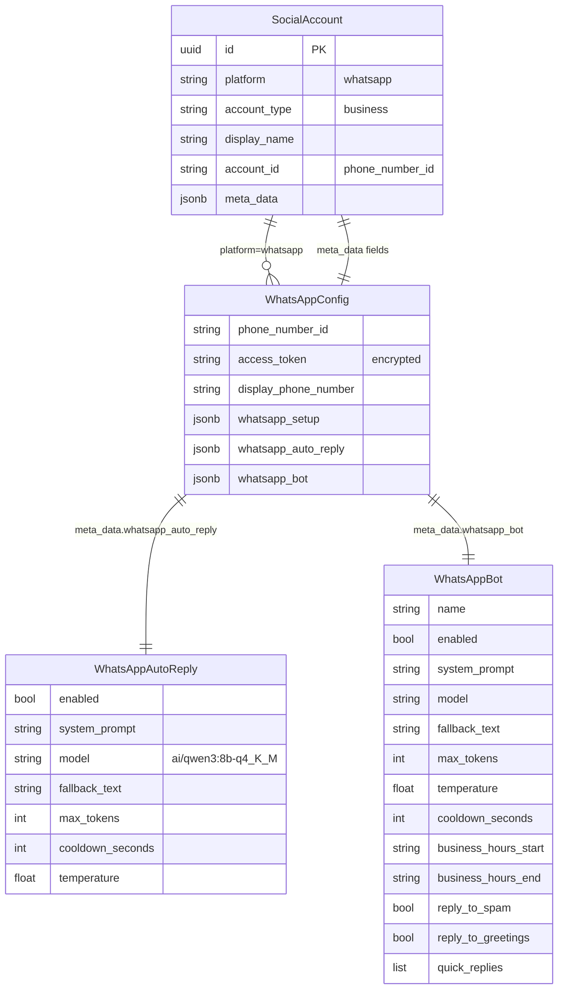
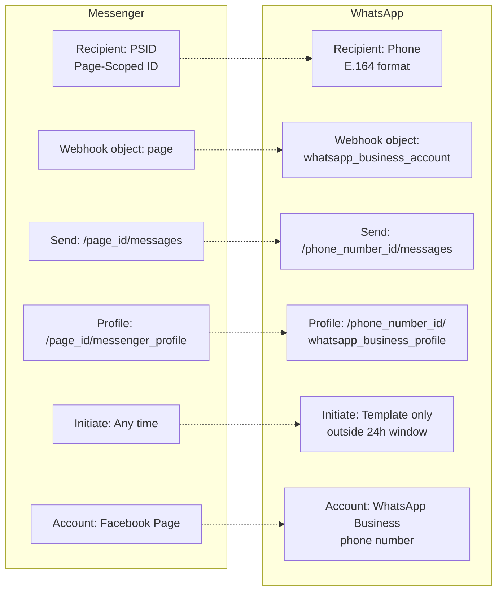
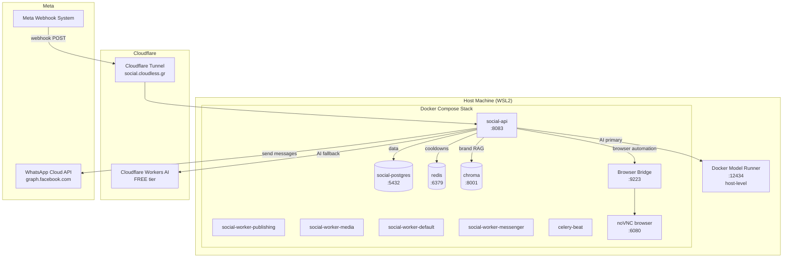

# WhatsApp Business Platform Architecture

## System Overview

## Registration Flow (4 Steps)

## Webhook Message Flow

## Bot Lifecycle

## File Architecture

## Endpoint Map

## AI Reply Decision Tree

## Data Model

## Comparison: Messenger vs WhatsApp

## Deployment Topology

