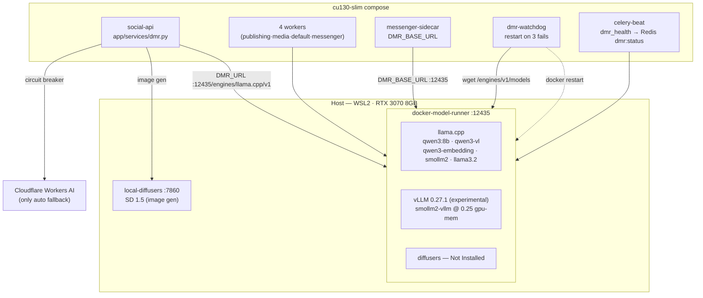

# Docker Model Runner (DMR) Architecture

## Overview

DMR is the **primary local text/vision/embedding inference engine** for the
SocialAuto stack. It runs as a host-level Docker engine container
(`docker-model-runner`, image `local/model-runner:vllm-cuda-fixed`) with GPU
access on the RTX 3070 (8 GB VRAM, WSL2). Cloudflare Workers AI is the **only**
cloud fallback; every other provider in `PROVIDER_CATALOG` is manual-selection
only.

Two inference backends are active:

- **llama.cpp** — default engine, GGUF quantized models, full GPU offload
  (`-ngl 999`). Serves all production traffic.
- **vLLM 0.27.1** — experimental, safetensors models only
  (`docker.io/ai/smollm2-vllm:latest` at `gpu-memory-utilization 0.25`).
  Provider `dmr-vllm`, manual selection only, never in the auto chain.
- **Diffusers** — `Not Installed` on WSL2/Docker Desktop. Image generation is
  handled by the separate `local-diffusers` container (SD 1.5, port 7860).

## Diagram

```
┌──────────────────────────────────────────────────────────────────────┐
│ Host: Windows/WSL2 · RTX 3070 Laptop GPU (8 GB)                      │
│                                                                      │
│  ┌────────────────────────────────────────────────────────────────┐  │
│  │ docker-model-runner  (local/model-runner:vllm-cuda-fixed)      │  │
│  │ 127.0.0.1:12435 · RestartPolicy=always                         │  │
│  │ volume: docker-model-runner-models                             │  │
│  │                                                                │  │
│  │  llama.cpp 72874f559 ── Running                                │  │
│  │  ├─ ai/qwen3:8b-q4_K_M   text+chatbot  ~5 GB VRAM              │  │
│  │  ├─ ai/qwen3-vl          vision        ~5 GB VRAM              │  │
│  │  ├─ ai/qwen3-embedding   embeddings    ~1 GB VRAM              │  │
│  │  ├─ ai/smollm2           tiny/fast     ~256 MB                 │  │
│  │  └─ ai/llama3.2          legacy        ~2 GB                   │  │
│  │                                                                │  │
│  │  vllm 0.27.1 ── Running (experimental, manual only)            │  │
│  │  └─ docker.io/ai/smollm2-vllm:latest  gpu-mem-util 0.25        │  │
│  │                                                                │  │
│  │  diffusers ── Not Installed (WSL2 unsupported)                 │  │
│  └────────────────────────────────────────────────────────────────┘  │
│                                                                      │
│  ┌────────────────────────────────────────────────────────────────┐  │
│  │ local-diffusers (compose)  SD 1.5 · port 7860 · ~2 GB VRAM     │  │
│  │ Primary local image generation                                 │  │
│  └────────────────────────────────────────────────────────────────┘  │
└──────────────────────────────────────────────────────────────────────┘
              ▲ host.docker.internal:12435
              │
┌─────────────┴────────────────────────────────────────────────────────┐
│ Compose network (cu130-slim)                                         │
│                                                                      │
│  social-api ──────────────── app/services/dmr.py (unified client)    │
│  social-worker-publishing ── DMR_URL → /engines/llama.cpp/v1         │
│  social-worker-media ──────── DMR_VLLM_URL → /engines/vllm/v1        │
│  social-worker-default ────── semaphore: DMR_MAX_CONCURRENCY=4       │
│  social-worker-messenger                                             │
│  messenger-sidecar ────────── DMR_BASE_URL → :12435 (no /engines)    │
│                                                                      │
│  dmr-watchdog ── wget /engines/v1/models every 60s,                  │
│                  docker restart docker-model-runner after 3 fails    │
│  celery-beat ──── dmr_health.check_dmr_health every 5 min            │
│                   → Redis key dmr:status (TTL 15 min)                │
└──────────────────────────────────────────────────────────────────────┘
              │ circuit breaker (3 failures → 60s open)
              ▼
┌──────────────────────────────────────────────────────────────────────┐
│ Cloudflare Workers AI — ONLY automatic cloud fallback                │
│ Text: @cf/meta/llama-3.1-8b-instruct (and catalog equivalents)       │
└──────────────────────────────────────────────────────────────────────┘
```

## Mermaid



## Models

| Model | Backend | Role | VRAM | Notes |
|-------|---------|------|------|-------|
| `ai/qwen3:8b-q4_K_M` | llama.cpp | Text + chatbot (`DMR_TEXT_MODEL` + `DMR_CHATBOT_MODEL`) | ~5 GB | One loaded model covers schema/JSON, content, and all chatbots |
| `ai/qwen3-vl` | llama.cpp | Vision (`DMR_VISION_MODEL`) — alt text, smart crop, tagging | ~5 GB | Shares GPU; auto-unloads when idle |
| `ai/qwen3-embedding` | llama.cpp | Embeddings (`DMR_EMBEDDING_MODEL`) for Chroma | ~1 GB | |
| `ai/smollm2` | llama.cpp | Tiny/fast (`DMR_TINY_MODEL`) — prompts <200 chars | ~256 MB | |
| `ai/llama3.2` | llama.cpp | Legacy / spare | ~2 GB | Pulled, not referenced by env |
| `docker.io/ai/smollm2-vllm:latest` | vLLM | Experimental | 0.25 GPU util | **Full ref required** — short name 404s once runtime config exists |
| `ai/stable-diffusion` | diffusers | — | — | Pulled (6.94 GB DDUF) but **cannot run on WSL2** |

## Endpoints

| Access | URL |
|--------|-----|
| Host | `http://localhost:12435` (bound to 127.0.0.1) |
| Containers | `http://host.docker.internal:12435` |
| OpenAI API | `/engines/v1/chat/completions`, `/engines/v1/models`, `/engines/v1/embeddings` |
| Engine-pinned | `/engines/llama.cpp/v1/...`, `/engines/vllm/v1/...` |
| Anthropic API | `/anthropic/v1/messages` |
| Ollama API | `/api/chat`, `/api/tags` |
| Native mgmt | `/models`, `/inference/status`, `/inference/ps`, `/inference/unload` |

## App wiring

| Env var | Value | Consumers |
|---------|-------|-----------|
| `DMR_URL` | `http://host.docker.internal:12435/engines/llama.cpp/v1` | social-api, all 4 workers |
| `DMR_VLLM_URL` | `http://host.docker.internal:12435/engines/vllm/v1` | social-api, workers (manual provider `dmr-vllm`) |
| `DMR_BASE_URL` | `http://host.docker.internal:12435` | messenger-sidecar (no `/engines` suffix) |
| `DMR_TEXT_MODEL` / `DMR_CHATBOT_MODEL` | `ai/qwen3:8b-q4_K_M` | content gen + Messenger/WhatsApp/Telegram bots |
| `DMR_VISION_MODEL` | `ai/qwen3-vl` | image_enhance, media_ai |
| `DMR_EMBEDDING_MODEL` | `ai/qwen3-embedding` | chroma_client |
| `DMR_TINY_MODEL` | `ai/smollm2` | short-prompt routing in dmr.py |
| `DMR_MAX_CONCURRENCY` | `4` | semaphore inside `app/services/dmr.py` |

`app/services/dmr.py` is the single client for all DMR traffic: shared httpx
pool (loop-aware for Celery prefork), health-check cache, cold-start retry,
model warm-up, per-request routing (short→smollm2, complex→qwen3), streaming,
tool calling, VRAM-aware loading, and CLI fallback when HTTP is unreachable.

## Fallback & resilience

- **Text inference**: DMR → Cloudflare Workers AI (only auto fallback).
- **Chatbots**: DMR → Cloudflare Workers AI → static reply.
- **Images**: local-diffusers (SD 1.5) → Cloudflare Workers AI.
- **Circuit breaker**: 3 DMR failures → route to Cloudflare for 60 s.
- **dmr-watchdog** (compose, `docker:27-cli` + host socket): polls
  `/engines/v1/models` every 60 s, restarts the runner after 3 consecutive
  failures. Handles "container up, engine wedged".
- **dmr_health Celery task** (every 5 min, default queue): probes runner,
  validates expected models, publishes to Redis `dmr:status` (TTL 15 min).
- **Persistence**: named volume `docker-model-runner-models`;
  `RestartPolicy=always`.
- **Recovery script**: `scripts/dmr/gpu-runner-recreate.sh` recreates the
  container if Docker Desktop resets it.

## vLLM runner specifics (WSL2)

The GPU runner was created with
`docker model install-runner --backend vllm --gpu cuda --port 12435`, then
patched:

- torch `+cpu` → `+cu126` in `/opt/vllm-env` (baked into the committed image
  `local/model-runner:vllm-cuda-fixed`).
- `VLLM_WSL2_ENABLE_PIN_MEMORY=1` — WSL2 disables pinned memory.
- `VLLM_USE_FLASHINFER_SAMPLER=0` — image lacks `ninja` for FlashInfer JIT.
- Per-model: `docker model configure docker.io/ai/smollm2-vllm:latest
  --gpu-memory-utilization 0.25` — **full ref required**; short names silently
  no-op. Reapply after `install-runner`/`reinstall-runner` recreates the
  container.

## Operations

```bash
docker model status                                  # backends
docker model list                                    # pulled models
docker model ps                                      # loaded in VRAM
curl -sf http://localhost:12435/engines/v1/models    # API health
nvidia-smi --query-gpu=memory.used,memory.total --format=csv
docker model configure --context-size 8192 ai/qwen3:8b-q4_K_M
docker model unload --all                            # free VRAM
scripts/dmr/gpu-runner-recreate.sh                   # heal runner
```

MCP server: `dmr` (`.devin/mcp_config.json`) — status, list, chat, embed,
pull, inspect, configure, generate_image. Skill:
`.devin/skills/docker-model-runner/` with per-operation shell scripts.

## Security

- No authentication on the DMR API — anything that can reach port 12435 can
  run inference. Bound to 127.0.0.1 on the host; containers reach it via
  `host.docker.internal`.
- No prompts or responses leave the machine (privacy-preserving); only the
  Cloudflare fallback path sends data off-box.
