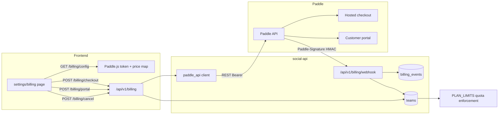

# Paddle Billing Architecture

Monetization layer for SocialAuto built on **Paddle Billing v2** (merchant of record — Paddle handles VAT/sales tax, invoicing, and payment methods). Currently wired end-to-end in **sandbox**; going live only requires env keys and a webhook destination (see [Go-live checklist](#go-live-checklist)).

## Design choices

- **Paddle over Stripe**: Paddle is merchant-of-record, so we don't manage tax compliance or invoices ourselves.
- **Server-side checkout transactions + optional Paddle.js overlay**: `POST /billing/checkout` creates a transaction and returns a hosted `checkout_url`. The frontend may alternatively use Paddle.js overlay with the `price_id` from `/billing/config`. Both paths set `custom_data.team_id`, so webhooks resolve the team with zero extra lookups.
- **Webhook-driven plan state**: `teams.plan_tier` is only mutated by verified webhook events (or the manual `/billing/sync` reconciliation endpoint). No client-side trust.
- **Idempotent webhooks**: every event is persisted in `billing_events` keyed by Paddle `event_id`; replayed deliveries short-circuit as `{"status": "duplicate"}`.
- **Cancel at period end**: cancellation uses `effective_from=next_billing_period`; the paid tier remains until `subscription_period_end`, then `subscription.canceled`/`expired` drops the team to `free`.

## Data flow

## Components

| Layer | File | Purpose |
|---|---|---|
| API client | `social-automation/backend/app/services/paddle_api.py` | Thin async wrapper: customers, checkout transactions, portal sessions, cancel, subscription fetch, webhook signature verification |
| Router | `social-automation/backend/app/api/billing.py` | 7 endpoints (below); OWNER-gated mutations |
| Event log | `social-automation/backend/app/models/billing.py` | `billing_events` table — idempotency + audit trail |
| Team fields | `social-automation/backend/app/models/user.py` | `paddle_customer_id`, `paddle_subscription_id`, `subscription_status`, `subscription_period_end` on `teams` |
| Config | `social-automation/backend/app/core/config.py` | `PADDLE_*` settings, `paddle_api_base`, `paddle_price_tiers` mapping |
| Migration | `alembic/versions/w6h7i8j9k0l1_add_paddle_billing.py` | Team columns + `billing_events` table |
| Frontend | `frontend/app/(dashboard)/settings/billing/page.tsx` | Plan cards, Paddle.js overlay checkout, portal redirect, cancel |

## API endpoints

Base: `/api/v1/billing`. All endpoints except `/webhook` require auth; mutations additionally require team **OWNER** role.

| Method | Path | Auth | Description |
|---|---|---|---|
| GET | `/config` | owner | Frontend bootstrap: `configured`, `environment`, `client_token`, `team_id`, `customer_email`, tier→price map |
| GET | `/plans` | member | Plan catalog — tiers, `PLAN_LIMITS` quotas, `purchasable` flag, `price_id` |
| GET | `/subscription` | member | Team billing state: `plan_tier`, `subscription_status`, period end, Paddle IDs |
| POST | `/checkout` `{tier}` | owner | Creates Paddle transaction → `{transaction_id, checkout_url}`; auto-creates Paddle customer on first use |
| POST | `/portal` | owner | Hosted customer-portal session URL (payment methods, invoices) |
| POST | `/cancel` | owner | Cancel at period end → `canceled_pending` |
| POST | `/sync` | owner | Pull latest subscription from Paddle, reconcile team row |
| POST | `/webhook` | signature | Paddle notification receiver (see below) |

## Webhook handling

`POST /api/v1/billing/webhook` — configure as a Paddle notification destination.

1. **Verify** `Paddle-Signature` header (`ts=…;h1=…`): HMAC-SHA256 of `"{ts}:{raw_body}"` with `PADDLE_WEBHOOK_SECRET`; constant-time compare; ±5 min timestamp freshness blocks replay. Invalid → 401.
2. **Persist** raw event in `billing_events` (unique `event_id`) before processing — duplicates return `{"status": "duplicate"}`.
3. **Resolve team**: `data.custom_data.team_id` first, then `paddle_customer_id` lookup.
4. **Apply** per event type:

| Event | Effect |
|---|---|
| `subscription.created/activated/updated/resumed` | `_apply_subscription`: stores sub ID, status, period end; maps `items[0].price.id` → tier via `paddle_price_tiers` (only on active/trialing/past_due) |
| `subscription.activated` | + activation email to team owner |
| `subscription.past_due` | status=`past_due` + payment-failed email |
| `subscription.canceled`/`expired` | status set, `plan_tier`→`free` + subscription-ended email |
| `subscription.paused` | status=`paused` |
| `transaction.completed`/`paid` | links `subscription_id` to team when present |

Handler failures are recorded on the event row (`error` column) and return 500 so Paddle retries.

## Tier ↔ price mapping

Prices are configured entirely via env — no hardcoded Paddle IDs:

| Env var | Maps to tier |
|---|---|
| `PADDLE_PRICE_PRO` | `pro` |
| `PADDLE_PRICE_BUSINESS` | `business` |
| `PADDLE_PRICE_ENTERPRISE` | `enterprise` |

`plan_tier` drives quota enforcement through the existing `PLAN_LIMITS` table (`posts_per_month`, `ai_calls_per_month`, `social_accounts`; `-1` = unlimited). `free` is never purchasable via checkout.

## Configuration

| Env var | Purpose |
|---|---|
| `PADDLE_ENVIRONMENT` | `sandbox` (default) or `production` — selects `sandbox-api.paddle.com` vs `api.paddle.com` |
| `PADDLE_API_KEY` | Server-side API key (Bearer) |
| `PADDLE_CLIENT_TOKEN` | Client-side token for Paddle.js overlay |
| `PADDLE_WEBHOOK_SECRET` | Notification destination secret for signature verification |
| `PADDLE_PRICE_{PRO,BUSINESS,ENTERPRISE}` | `pri_…` price IDs per tier |

`paddle_configured()` requires API key + client token; `/billing/*` mutations return **503** when unset, so the app runs fine without Paddle configured.

## Go-live checklist

Deferred — do not run until ready to sell:

1. Create products + prices in the **production** Paddle catalog; copy the `pri_…` IDs.
2. Set `PADDLE_ENVIRONMENT=production`, production `PADDLE_API_KEY`, `PADDLE_CLIENT_TOKEN` in `.env` (api + worker env blocks in `docker-compose.yml` already pass them through).
3. Create a notification destination in Paddle → `https://social.cloudless.gr/api/v1/billing/webhook`; set `PADDLE_WEBHOOK_SECRET` to the generated secret; subscribe to `subscription.*` and `transaction.*` events.
4. Restart `social-api`; verify `GET /api/v1/billing/config` returns `configured: true` and plan cards become `purchasable`.
5. Run one sandbox→prod checkout with a test card, confirm `subscription.activated` lands in `billing_events` and `plan_tier` flips.
6. Paddle account approval: domain verification + checkout/website review must be completed in the Paddle dashboard before production transactions process.

## Operational notes

- **Webhook audit**: `SELECT event_type, processed_at, error FROM billing_events ORDER BY processed_at DESC;` — replayed/failed deliveries are visible here.
- **Manual reconcile**: if a webhook is missed, `POST /api/v1/billing/sync` re-pulls subscription state.
- **Self-serve signup** already exists at `POST /api/v1/auth/register` (creates user + team + welcome email); new teams land on `free` until a Paddle subscription activates.
- Admin team runs on `enterprise` with unlimited quotas — billing state does not restrict it.
