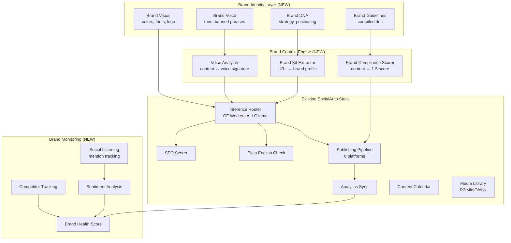

# AI Branding Expansion Plan — SocialAuto

> **Goal**: Transform SocialAuto from a multi-platform publishing tool into a full AI branding platform that creates, enforces, and monitors a brand identity across every connected social channel.

> **Principle**: Cloudflare-first, free-first. Reuse existing inference routing, SEO, plain-English, media storage, and analytics infrastructure. No new paid dependencies unless explicitly noted.

---

## Market Research — What Commercial Competitors Do

### Category 1: AI Brand Identity Generators
**Products**: uBrand, BrandingStudio.ai, The Brand Protocol, Glyph, BrandCaster

| Feature | What they do |
|---------|-------------|
| Brand DNA / Strategy | AI interviews you about audience, positioning, values → structured brand brief |
| Logo generation | Multiple SVG logo concepts from brand name + industry |
| Color palette | Primary/accent/neutral palette with WCAG accessibility checks |
| Typography system | Heading + body font pairings with type scale |
| Brand voice & tone | Tone dimensions (formal, playful, authoritative), banned phrases, messaging pillars |
| Brand guidelines doc | Auto-compiled microsite or PDF with all rules |
| Launch assets | Social templates, email headers, business cards, favicons, OG images |

### Category 2: Brand-Aware Content Generation
**Products**: Brandforge, Mavic, Brandlix, Advibly, Postly Brand Kit, Brande.ai, Robynn AI

| Feature | What they do |
|---------|-------------|
| Brand Kit as context layer | Every AI generation receives brand voice, colors, banned phrases as system context |
| Brand Voice Analyzer | Analyze existing content to codify voice signature |
| On-brand content scoring | Score every draft 1-5 against brand guidelines before publish |
| Multi-platform variant generation | One brief → platform-specific variants (LinkedIn professional, TikTok casual, etc.) |
| Content calendar auto-fill | AI fills empty calendar slots with on-brand content suggestions |
| Banned phrases enforcement | Block off-brand words/phrases from ever being published |
| Visual brand enforcement | Check generated images against color palette, logo placement rules |

### Category 3: Brand Monitoring & Intelligence
**Products**: Brand24, Brandwatch, Rival IQ, BrandJet AI, Shensuo, Mentient

| Feature | What they do |
|---------|-------------|
| Social listening | Track brand mentions across social, news, blogs, forums |
| Sentiment analysis | Score every mention as positive/negative/neutral |
| Competitor tracking | Monitor competitor mentions, engagement, content strategy |
| AI search visibility | Track how ChatGPT/Claude/Gemini mention your brand |
| Brand health score | Aggregate metric combining reach, sentiment, share of voice |
| Alerts & notifications | Real-time alerts for negative sentiment spikes or viral mentions |

### Category 4: Autonomous Social Media Management
**Products**: ZocialOne, Beevi, Brandlix

| Feature | What they do |
|---------|-------------|
| Agentic AI | AI agent with 100+ tools that can create, schedule, analyze, reply |
| Full autopilot | Set preferences → AI generates, schedules, publishes automatically |
| Unified inbox | DM and comment management across all platforms |
| Competitor research | AI scans competitor channels and suggests content gaps |
| A/B testing | Auto-generate variants and test which performs better |

---

## What SocialAuto Already Has

| Capability | Status | Location |
|-----------|--------|----------|
| Multi-platform publishing (6 platforms) | ✅ Done | `app/services/publishing.py` |
| AI content generation | ✅ Done | `app/services/inference.py`, `app/api/ai.py` |
| Cloudflare Workers AI routing | ✅ Done | `app/services/cf_models.py`, `inference.py` |
| SEO scoring per platform | ✅ Done | `app/services/seo.py` |
| Plain-English check & rewrite | ✅ Done | `app/services/plain_english.py` |
| Spell/grammar check (LanguageTool) | ✅ Done | `app/services/spellcheck.py` |
| Analytics sync (all platforms) | ✅ Done | `app/services/analytics_sync.py` |
| Follower counts (all platforms) | ✅ Done | `app/api/analytics.py` |
| Media library (R2 → MinIO → disk) | ✅ Done | `app/services/media_storage.py` |
| AI image generation (FLUX schnell) | ✅ Done | `app/services/carousel_pipeline.py` |
| Carousel generation (Cloudflare-only) | ✅ Done | `app/services/carousel_pipeline.py` |
| Team & multi-tenant model | ✅ Done | `app/models/user.py` (Team, TeamMember) |
| Content calendar & queue | ✅ Done | `app/models/queue.py`, `frontend/calendar/` |
| Token refresh & validation | ✅ Done | `app/api/accounts.py` |
| Cloudflare D1 sync | ✅ Done | `app/services/db_sync.py` |
| Hardcoded carousel brand config | ⚠️ Partial | `frontend/carousel/new/page.tsx` (4 hardcoded themes) |
| AI provider management | ✅ Done | `app/models/ai_provider.py`, `app/api/ai_providers.py` |

### What's Missing (the gaps this plan fills)

1. **No Brand model** — no database table stores brand identity, voice, colors, or guidelines
2. **No Brand Kit context layer** — AI generation doesn't receive brand context in prompts
3. **No brand voice analyzer** — can't learn voice from existing content
4. **No on-brand scoring** — no compliance check before publishing
5. **No brand monitoring** — no mention tracking, sentiment, or competitor analysis
6. **No brand asset management** — logos and templates are hardcoded, not stored per team
7. **No brand-aware image generation** — carousel themes are hardcoded, not driven by brand kit
8. **No brand guidelines page** — no UI to view or share brand rules
9. **No banned phrases enforcement** — nothing stops off-brand content
10. **No brand health dashboard** — analytics exist but no brand-level aggregation

---

## Architecture Overview



---

## Implementation Phases

### Phase 1 — Brand Identity Model & Storage (Foundation)
**Estimated effort**: 2-3 sessions

#### 1.1 Database models

New file: `app/models/brand.py`

```
Brand
├── id (UUID, PK)
├── team_id (FK → teams)
├── name (str)
├── industry (str)
├── positioning_statement (text)
├── mission (text)
├── values (JSON array)
├── target_audience (JSON: {demographics, pain_points, goals})
├── competitor_names (JSON array)
├── created_at, updated_at
└── relationship: team, voice, visual, guidelines

BrandVoice
├── id (UUID, PK)
├── brand_id (FK → brands)
├── tone_dimensions (JSON: {formal: 1-5, playful: 1-5, authoritative: 1-5, friendly: 1-5, technical: 1-5})
├── messaging_pillars (JSON array of {title, description})
├── banned_phrases (JSON array of strings)
├── preferred_phrases (JSON array of strings)
├── example_content (text — reference content that embodies the voice)
├── voice_signature (JSON — extracted from Voice Analyzer)
├── created_at, updated_at

BrandVisual
├── id (UUID, PK)
├── brand_id (FK → brands)
├── primary_color (str — hex)
├── accent_color (str — hex)
├── neutral_colors (JSON array of hex)
├── font_heading (str)
├── font_body (str)
├── type_scale (JSON: {h1: px, h2: px, body: px, small: px})
├── logo_url (str — R2/MinIO URL)
├── logo_variants (JSON: {dark, light, monochrome})
├── image_style (text — description for AI image generation)
├── photography_direction (text)
├── created_at, updated_at

BrandGuidelines
├── id (UUID, PK)
├── brand_id (FK → brands)
├── content (JSON — full structured guidelines)
├── share_token (str — for public sharing)
├── version (int)
├── created_at, updated_at

BrandAsset
├── id (UUID, PK)
├── brand_id (FK → brands)
├── media_asset_id (FK → media_assets)
├── asset_type (enum: logo, social_template, og_image, favicon, email_header, business_card)
├── metadata (JSON)
├── created_at
```

#### 1.2 Alembic migration
- `add_brand_tables.py` — creates all 5 tables with indexes
- Sync to D1 via existing `db_sync.py` pattern

#### 1.3 API endpoints
New file: `app/api/brand.py`

```
POST   /api/v1/brand                    — create brand for team
GET    /api/v1/brand                    — get team's brand
PUT    /api/v1/brand                    — update brand
DELETE /api/v1/brand                    — delete brand

POST   /api/v1/brand/voice              — create/update brand voice
GET    /api/v1/brand/voice              — get brand voice
PUT    /api/v1/brand/voice              — update voice dimensions

POST   /api/v1/brand/visual             — create/update brand visual
GET    /api/v1/brand/visual             — get brand visual
PUT    /api/v1/brand/visual             — update colors/fonts
POST   /api/v1/brand/visual/logo        — upload logo (R2/MinIO)

GET    /api/v1/brand/guidelines         — get compiled guidelines
POST   /api/v1/brand/guidelines/compile — compile from brand+voice+visual
GET    /api/v1/brand/guidelines/share   — public share via token

GET    /api/v1/brand/assets             — list brand assets
POST   /api/v1/brand/assets             — add asset
```

#### 1.4 Frontend
New pages under `frontend/app/(dashboard)/brand/`:
- `page.tsx` — Brand overview dashboard
- `identity/page.tsx` — Brand DNA editor (name, industry, positioning, mission, values)
- `voice/page.tsx` — Voice & tone editor with sliders, banned phrases, example content
- `visual/page.tsx` — Color palette picker, font selector, logo upload
- `guidelines/page.tsx` — Compiled guidelines viewer with share link
- `assets/page.tsx` — Brand asset library

---

### Phase 2 — Brand Kit Extractor & Voice Analyzer (AI-powered onboarding)
**Estimated effort**: 2-3 sessions

#### 2.1 Brand Kit Extractor
New file: `app/services/brand_extractor.py`

**Input**: Website URL (e.g. `https://cloudless.gr`)
**Process**:
1. Fetch website HTML with httpx
2. Extract:
   - Logo (from `` or favicon)
   - Colors (parse CSS, `<meta name="theme-color">`, inline styles)
   - Fonts (from CSS `font-family` declarations)
   - Tagline / meta description
   - About page text (follow `/about` link)
3. Use Cloudflare Workers AI to analyze extracted text → brand positioning, tone dimensions
4. Return structured `BrandKitDraft` that user can review and edit

```python
async def extract_brand_from_url(url: str) -> BrandKitDraft:
    """Scrape a website and extract a draft brand kit."""
    # 1. Fetch homepage + about page
    # 2. Parse HTML for colors, fonts, logo, meta tags
    # 3. Send extracted text to CF Workers AI for tone analysis
    # 4. Return structured draft
```

#### 2.2 Brand Voice Analyzer
New file: `app/services/brand_voice.py`

**Input**: 3-5 sample content pieces (existing posts, blog articles, website copy)
**Process**:
1. Send samples to Cloudflare Workers AI with a structured prompt:
   - "Analyze the tone of this content. Rate formality (1-5), playfulness (1-5), authority (1-5), friendliness (1-5), technical depth (1-5)."
   - "Extract 5 recurring phrases or patterns."
   - "List 5 phrases this brand would NEVER use."
2. Return `VoiceSignature` JSON

```python
async def analyze_brand_voice(samples: list[str]) -> VoiceSignature:
    """Analyze content samples and return a voice signature."""
```

#### 2.3 Frontend onboarding flow
- `brand/onboarding/page.tsx` — 3-step wizard:
  1. "Enter your website URL" → auto-extract brand kit draft
  2. "Paste 3 examples of content you love" → analyze voice
  3. Review & edit → save as Brand + BrandVoice + BrandVisual

---

### Phase 3 — Brand Context Engine (On-brand generation)
**Estimated effort**: 3-4 sessions

#### 3.1 Brand context injection
Modify: `app/services/inference.py`

Add a `brand_context` parameter to `call_inference()` that builds a system prompt from the team's Brand Kit:

```python
def build_brand_system_prompt(brand: Brand, voice: BrandVoice, visual: BrandVisual) -> str:
    """Build a system prompt that enforces brand identity."""
    return f"""You are writing content for {brand.name}.

Brand positioning: {brand.positioning_statement}
Target audience: {brand.target_audience}

Voice & tone:
- Formality: {voice.tone_dimensions['formal']}/5
- Playfulness: {voice.tone_dimensions['playful']}/5
- Authority: {voice.tone_dimensions['authoritative']}/5
- Friendliness: {voice.tone_dimensions['friendly']}/5

Messaging pillars: {voice.messaging_pillars}

NEVER use these phrases: {voice.banned_phrases}
Preferred phrases: {voice.preferred_phrases}

Example of on-brand content: {voice.example_content}
"""
```

#### 3.2 Brand compliance scorer
New file: `app/services/brand_compliance.py`

```python
async def score_brand_compliance(
    content: str,
    brand: Brand,
    voice: BrandVoice,
    platform: str,
) -> BrandComplianceReport:
    """Score content against brand guidelines. Returns 1-5 score + issues."""
    # 1. Check banned phrases (exact match)
    # 2. Check preferred phrases (presence bonus)
    # 3. Send to AI for tone/voice match scoring
    # 4. Check platform-specific constraints (reuse seo.py hints)
    # 5. Return score + list of issues + suggested fixes
```

#### 3.3 Wire into content generation
Modify: `app/api/ai.py`

Every AI content generation endpoint should:
1. Load the team's Brand Kit
2. Inject brand context into the inference call
3. Score the output for brand compliance
4. Return the score alongside the generated content

Modify: `app/api/content.py`

Before publishing:
1. Run brand compliance check
2. If score < 3/5, warn the user (but allow override)
3. Log the compliance score to `Post.meta_data`

#### 3.4 Frontend integration
- Add a "Brand Compliance" panel to the post editor (next to SEO Panel)
- Show score, issues, and suggested fixes
- Add a "Regenerate on-brand" button that re-runs generation with stronger brand context
- Add brand compliance badge to calendar items

---

### Phase 4 — Brand-Aware Visual Generation
**Estimated effort**: 2-3 sessions

#### 4.1 Brand-driven carousel themes
Modify: `app/services/carousel_pipeline.py` and `frontend/carousel/new/page.tsx`

Replace the 4 hardcoded themes with brand-driven themes:
1. Load team's `BrandVisual` from database
2. Generate theme from brand colors, fonts, and image style
3. Use brand logo URL instead of hardcoded SVG
4. Pass brand photography direction to FLUX schnell image generation

#### 4.2 Brand-aware AI image generation
Modify: `app/services/inference.py` image generation

When generating images for posts:
1. Inject brand visual context into the prompt:
   - Color palette
   - Photography direction
   - Image style description
2. Post-process: check if generated image colors are close to brand palette
3. If not, re-generate with stronger color guidance

#### 4.3 Brand asset generator
New file: `app/services/brand_assets.py`

Generate launch assets from brand identity:
- Social media templates (post, story, cover) — SVG with brand colors/fonts
- OG image template
- Favicon from logo
- Email header
- Business card layout

All generated as SVG/PNG and stored in the media library.

---

### Phase 5 — Brand Monitoring & Intelligence
**Estimated effort**: 3-4 sessions

#### 5.1 Social listening
New file: `app/services/brand_monitoring.py`

```python
async def search_brand_mentions(
    brand_name: str,
    platforms: list[str],
    since: datetime,
) -> list[BrandMention]:
    """Search for brand mentions across connected platforms."""
    # LinkedIn: search API for company name in posts/comments
    # Twitter/X: /2/tweets/search/recent query=brand_name
    # Reddit: /search.json?q=brand_name (free, no auth)
    # News: Google News RSS feed (free, no auth)
```

New model: `BrandMention`
```
├── id (UUID, PK)
├── brand_id (FK → brands)
├── platform (str)
├── mention_text (text)
├── mention_url (str)
├── author_name (str)
├── author_avatar (str)
├── sentiment (enum: positive, negative, neutral)
├── engagement_count (int)
├── mentioned_at (datetime)
├── discovered_at (datetime)
├── meta_data (JSON)
```

#### 5.2 Sentiment analysis
Use Cloudflare Workers AI (text classification model) to score each mention:
```python
async def analyze_sentiment(text: str) -> str:
    """Return 'positive', 'negative', or 'neutral'."""
    # Use CF Workers AI text classification or local Ollama
```

#### 5.3 Competitor tracking
- Store competitor names in `Brand.competitor_names`
- Periodically fetch competitor social metrics (followers, engagement rate)
- Compare with own metrics → share of voice calculation
- Store in new `CompetitorSnapshot` model

#### 5.4 Brand health score
New endpoint: `GET /api/v1/brand/health`

Aggregate metric combining:
- Reach (from analytics sync)
- Sentiment (from mention tracking)
- Share of voice (vs competitors)
- Engagement rate (from analytics)
- Posting consistency (from calendar)

Returns a 0-100 score with breakdown and trend over time.

#### 5.5 Frontend
New pages under `frontend/app/(dashboard)/brand/`:
- `monitoring/page.tsx` — mention feed with sentiment filter
- `competitors/page.tsx` — competitor comparison dashboard
- `health/page.tsx` — brand health score with trend chart

---

### Phase 6 — Autonomous Brand Content (Agentic)
**Estimated effort**: 4-5 sessions

#### 6.1 Brand content agent
New file: `app/services/brand_agent.py`

A Celery task that runs on a schedule (e.g. daily) and:
1. Reads the brand calendar for empty slots in the next 7 days
2. For each empty slot:
   a. Select a content topic from brand messaging pillars
   b. Generate on-brand content for the target platform
   c. Score brand compliance — only keep if score >= 4/5
   d. Generate or select a matching image from brand assets
   e. Create a draft post in the calendar
3. Notify the user: "I drafted 5 posts for next week — review and approve"

#### 6.2 Trend-aware content suggestions
New file: `app/services/trend_scout.py`

Before generating content, the agent checks:
1. Twitter/X trending topics for the brand's industry
2. Reddit hot posts in relevant subreddits
3. Brand's recent top-performing posts (from analytics)
4. Competitor's recent high-engagement posts

Uses these as inspiration context for the AI generation.

#### 6.3 A/B variant testing
- Generate 2-3 variants of each post
- Publish variant A to one platform, variant B to another
- Track which variant performs better
- Feed results back into the brand voice model

#### 6.4 Frontend
- `brand/autopilot/page.tsx` — configure autonomous content settings
  - Posting frequency
  - Platforms to auto-generate for
  - Approval mode: auto-publish vs. draft-only
  - Content topics from messaging pillars
  - Trend sensitivity (conservative vs. trend-chasing)

---

## Data Flow Summary

```
User onboards → Brand Kit Extractor → Brand + Voice + Visual stored
                                        ↓
User creates post → AI generation + Brand Context → Brand Compliance Score
                                        ↓
Post passes compliance → Publishing Pipeline → Analytics Sync
                                        ↓
Analytics + Mentions + Competitors → Brand Health Score → Dashboard
                                        ↓
Brand Agent reads health + calendar → Auto-generates drafts → User approves
```

---

## New Files Summary

### Backend
| File | Purpose |
|------|---------|
| `app/models/brand.py` | Brand, BrandVoice, BrandVisual, BrandGuidelines, BrandAsset models |
| `app/models/brand_monitoring.py` | BrandMention, CompetitorSnapshot models |
| `app/api/brand.py` | Brand CRUD + voice + visual + guidelines endpoints |
| `app/api/brand_monitoring.py` | Mention feed, sentiment, health score endpoints |
| `app/services/brand_extractor.py` | URL → brand kit draft |
| `app/services/brand_voice.py` | Content samples → voice signature |
| `app/services/brand_compliance.py` | Content → compliance score + issues |
| `app/services/brand_assets.py` | Brand → launch assets (SVG/PNG) |
| `app/services/brand_monitoring.py` | Mention search + sentiment + competitor tracking |
| `app/services/brand_agent.py` | Autonomous content generation Celery task |
| `app/services/trend_scout.py` | Trend discovery for content inspiration |
| `alembic/versions/xxx_add_brand_tables.py` | Migration for all brand tables |

### Backend modifications
| File | Change |
|------|--------|
| `app/services/inference.py` | Add `brand_context` param, build brand system prompt |
| `app/services/carousel_pipeline.py` | Load brand visual from DB instead of hardcoded themes |
| `app/api/ai.py` | Inject brand context into all generation endpoints |
| `app/api/content.py` | Run compliance check before publish |
| `app/worker/tasks.py` | Add brand monitoring + brand agent scheduled tasks |

### Frontend
| Path | Purpose |
|------|---------|
| `app/(dashboard)/brand/page.tsx` | Brand overview dashboard |
| `app/(dashboard)/brand/onboarding/page.tsx` | 3-step brand kit wizard |
| `app/(dashboard)/brand/identity/page.tsx` | Brand DNA editor |
| `app/(dashboard)/brand/voice/page.tsx` | Voice & tone editor |
| `app/(dashboard)/brand/visual/page.tsx` | Color/font/logo editor |
| `app/(dashboard)/brand/guidelines/page.tsx` | Guidelines viewer + share |
| `app/(dashboard)/brand/assets/page.tsx` | Brand asset library |
| `app/(dashboard)/brand/monitoring/page.tsx` | Mention feed + sentiment |
| `app/(dashboard)/brand/competitors/page.tsx` | Competitor dashboard |
| `app/(dashboard)/brand/health/page.tsx` | Brand health score |
| `app/(dashboard)/brand/autopilot/page.tsx` | Autonomous content config |
| `src/components/brand/BrandCompliancePanel.tsx` | Compliance score in post editor |
| `src/components/brand/BrandKitWizard.tsx` | Reusable onboarding wizard |
| `src/components/brand/ColorPalettePicker.tsx` | Color picker with WCAG check |
| `src/components/brand/ToneSliders.tsx` | Voice dimension sliders |
| `src/hooks/useBrand.ts` | Brand API hooks (useBrand, useBrandVoice, etc.) |

---

## Cloudflare-First Strategy

| Capability | Cloudflare Service | Free Tier Limit | Fallback |
|-----------|-------------------|-----------------|----------|
| Brand voice analysis | Workers AI (text) | 10K req/day | Ollama local |
| Sentiment analysis | Workers AI (text classification) | 10K req/day | Ollama local |
| Brand compliance scoring | Workers AI (text) | 10K req/day | Ollama local |
| Logo/asset storage | R2 | 10 GB | MinIO / local disk |
| Brand guidelines sharing | Pages / Workers | 100K req/day | N/A |
| Mention search (Twitter) | Existing Twitter API | 500K req/month | N/A |
| Mention search (Reddit) | Reddit JSON API (free) | Unlimited | N/A |
| Mention search (News) | Google News RSS (free) | Unlimited | N/A |
| Competitor metrics | Existing analytics sync | Per-platform limits | N/A |
| Trend discovery | Twitter/X trends API | 500K req/month | Reddit hot posts |
| Brand health cron | Cron Triggers | 5 crons/worker | Celery beat |

---

## Priority Order

| Priority | Phase | Why |
|----------|-------|-----|
| P0 | Phase 1 — Brand model & storage | Everything depends on this |
| P0 | Phase 3.1 — Brand context injection | Core value: on-brand generation |
| P1 | Phase 2 — Brand Kit Extractor | Frictionless onboarding |
| P1 | Phase 3.2-3.4 — Compliance scoring | Quality gate before publish |
| P1 | Phase 4 — Brand-aware visuals | Carousel themes from brand |
| P2 | Phase 5 — Brand monitoring | Differentiation from scheduling tools |
| P2 | Phase 6 — Autonomous agent | Compete with ZocialOne/Brandlix |

---

## Competitive Positioning After Implementation

| Feature | SocialAuto (after) | uBrand | Brandforge | Mavic | Brand24 |
|---------|-------------------|--------|------------|-------|---------|
| Multi-platform publishing | 6 platforms | 3 | 8 | 7 | 0 |
| AI content generation | ✅ CF Workers AI | ✅ | ✅ GPT-4o | ✅ GPT-4o/Claude | ❌ |
| Brand identity creation | ✅ | ✅ | ❌ | ❌ | ❌ |
| Brand voice analysis | ✅ | ❌ | ✅ | ✅ | ❌ |
| Brand compliance scoring | ✅ | ❌ | ✅ | ❌ | ❌ |
| Brand-aware image gen | ✅ CF FLUX | ❌ | ✅ | ✅ | ❌ |
| Social listening | ✅ | ❌ | ❌ | ❌ | ✅ |
| Sentiment analysis | ✅ CF Workers AI | ❌ | ❌ | ❌ | ✅ |
| Competitor tracking | ✅ | ❌ | ❌ | ❌ | ✅ |
| Brand health score | ✅ | ❌ | ❌ | ✅ | ✅ |
| Autonomous content | ✅ | ❌ | ✅ | ✅ | ❌ |
| Self-hosted / private | ✅ | ❌ | ❌ | ❌ | ❌ |
| Cloudflare-first / free | ✅ | ❌ | ❌ | ❌ | ❌ |

**Key differentiators**: Self-hosted, Cloudflare-first (no per-request AI costs), full brand lifecycle (identity → content → monitoring → autopilot), and existing 6-platform publishing + analytics.
