# SocialAuto 1–3 Month Product Roadmap

> Plan ID: `plan-e6a92ed66b9dca4a`  
> Status: **DRAFT — pending approval before implementation resumes**  
> Horizon: 1–3 months  
> Product: Cloudless `cloudless.gr` SocialAuto — AI-powered social publishing & analytics

---

## 1. Executive Summary

### 1.1 End state
A self-hosted, multi-tenant SocialAuto product that lets the Cloudless team (and future customers):

- Connect and publish to **LinkedIn Company Pages** (primary) plus personal profiles and other platforms later.
- Generate text, images, carousels, articles, hashtags, and comments with **Cloudflare Workers AI first**, with smart fallbacks to Groq, Together, Pixazo, Hugging Face, and Ollama.
- Schedule and queue content, get plain-English and SEO quality feedback, and automate carousels + daily digests through n8n.
- View analytics dashboards, post-level snapshots, follower counts, and exports.
- Manage media assets, workflows, AI providers, accounts, and team permissions from a single dashboard.

### 1.2 Guiding principles
1. **Cloudflare first, smart fallbacks** — general inference can fall back; the canonical Cloudless LinkedIn carousel path stays CF-only.
2. **Company Page as default** — LinkedIn publishing targets `4a8d9440-47d2-4bda-bd11-3776fd9022ba` unless the user explicitly selects otherwise.
3. **Plain English as a product moat** — every AI-generated text is checked for jargon, sentence length, and readability before it is stored or published.
4. **Observability & cost control** — every inference call is logged to `AIUsageLog`; provider routing, quotas, and retries are visible in the UI.
5. **Safe, reversible deployments** — all schema changes use Alembic; risky releases are feature-flagged in code and configurable in Settings.

### 1.3 Non-goals for this horizon
- New native platform OAuth (TikTok, YouTube) unless infrastructure already exists.
- Replacing n8n scheduling with an in-house scheduler.
- Training custom models.

---

## 2. Current State (as of plan start)

### 2.1 Backend
- FastAPI + SQLAlchemy 2 async + Pydantic v2.
- OAuth, content, media, workflow, account, analytics, AI, publishing, and ops APIs exist.
- `call_inference` routes to Cloudflare Workers AI, Groq, Together, Pixazo, HF, Ollama with fallbacks.
- Carousel pipeline is Cloudflare-only and posts as the configured LinkedIn Company Page.
- LinkedIn REST client (`app/services/linkedin_api.py`) supports token validation, organization lookup, post/comment/image/document publishing, analytics, and follower counts.
- Celery workers for publishing, analytics, and digests.
- n8n workflows: `cloudless-cf-carousel-linkedin` and `socialauto-daily-slack-digest`.

### 2.2 Frontend
- Next.js + React + TypeScript + TanStack Query + Recharts.
- Dashboard, calendar, content editor, media library, accounts, workflows, analytics, settings.
- Existing content forms for article, carousel, poll, story, thread.

### 2.3 Missing / under-defined
- No dedicated SEO subsystem.
- No `AIUsageLog` or usage dashboards.
- `call_inference` did not persist usage or expose endpoint-level attribution.
- Multi-image and document publishing lived partly outside `linkedin_api.py`.
- Frontend has no dedicated LinkedIn-first composer.
- `.env.example` was incomplete for new provider free-tier documentation.

---

## 3. Roadmap Phases

### Phase 0 — Foundation & quality (Week 1)
**Goal:** make the existing code production-grade and observability-first.

| # | Task | Acceptance |
|---|------|------------|
| 0.1 | Stabilize `LinkedInAPIClient` error handling and integrate it into `publishing.py` | All 28 LinkedIn unit tests pass; `LinkedInAPIError` is converted to `HTTPException` 502/503 in API; worker restarts cleanly. |
| 0.2 | Add `LinkedInAPIClient.create_multi_image_post` and `create_document_post` | Unit tests for multi-image and document posts pass; carousel pipeline still uses PDF → Documents API. |
| 0.3 | Add `AIUsageLog` model, migration, and usage tracking wrapper around `call_inference` | Every inference call creates a row with provider/model/endpoint/latency/success; table created via Alembic; no inference call blocked by logging failure. |
| 0.4 | Update `.env.example` with free-tier caps and links for CF, Groq, Together, Pixazo, HF, OpenAI | File is consistent with `app/core/config.py`; no secrets committed. |
| 0.5 | Fix import / lint / type issues surfaced by Ruff | `ruff check` clean on new files. |

**Exit criteria:** `pytest tests/unit` green; container healthcheck green; `ruff` clean.

### Phase 1 — LinkedIn & frontend surface (Weeks 1–2)
**Goal:** turn LinkedIn into a first-class product surface.

| # | Task | Acceptance |
|---|------|------------|
| 1.1 | Add frontend `linkedinApi` client and React Query hooks | All LinkedIn AI and helper endpoints callable from `api.ts` and `useQueries.ts`. |
| 1.2 | Create `/content/linkedin` page | Generate post, improve, hashtags, best-time, account selector, preview, and direct publish all work; defaults to Company Page; empty state if no account. |
| 1.3 | Add LinkedIn to sidebar navigation | Link routes to `/content/linkedin` with `Linkedin` icon. |
| 1.4 | Frontend integration tests / Playwright smoke | At minimum a login + navigate + generate post smoke test. |

### Phase 2 — SEO & content quality (Weeks 2–3)
**Goal:** define and ship SEO as a product feature.

| # | Task | Acceptance |
|---|------|------------|
| 2.1 | Add `app/services/seo.py` | Keyword extraction, content scoring, meta title/description suggestions, recommendations. |
| 2.2 | Add `POST /ai/seo` endpoint | Returns `platform`, `score`, `keywords`, `meta`, `character_count`, `hashtag_count`, `link_count` for LinkedIn, Twitter, Instagram, Facebook, Threads. |
| 2.3 | Extend `POST /ai/analyze-content` | Adds `plain_english_issues` and `average_sentence_words` to existing response. |
| 2.4 | Surface SEO feedback in the content composer | New “SEO” panel with score, keyword chips, and improvement suggestions. |
| 2.5 | Add lightweight unit tests for `seo.py` | `score_content` and `extract_keywords` tests pass. |

### Phase 3 — Analytics, snapshots, and dashboards (Weeks 3–5)
**Goal:** make post and organization analytics trustworthy and explorable.

| # | Task | Acceptance |
|---|------|------------|
| 3.1 | LinkedIn post & organization analytics sync jobs | Celery tasks pull `post_analytics` and `organization_lifetime_stats` daily; store in `PostAnalyticsSnapshot` and `AnalyticsEvent`. |
| 3.2 | Follower growth time series | New `GET /analytics/followers` and frontend `useFollowerGrowth` hook with timezone-aware aggregation. |
| 3.3 | Best-time recommendations backed by analytics | Fallback to heuristics until enough data; expose per-team trending hours in UI. |
| 3.4 | Export (CSV/JSON) for analytics | `/analytics/export` supports date range, platform, post-level. |
| 3.5 | Data freshness indicator | UI shows “last synced X min ago” and a manual “Sync now” button. |

### Phase 4 — Provider routing, quotas, and cost control (Weeks 4–6)
**Goal:** turn “CF first, smart fallbacks” into policy and UI.

| # | Task | Acceptance |
|---|------|------------|
| 4.1 | Provider routing policy engine | Per-endpoint default provider, allowed fallbacks, timeout, max retries stored in `AIProvider` / config. |
| 4.2 | Quota tracking and alerts | Read Cloudflare neuron headers where available; estimate fallback provider spend; warn when daily quota is 80% used. |
| 4.3 | AI provider usage dashboard | Frontend `/settings/ai-providers/usage` shows calls, latency, failures, and estimated cost by provider/model/endpoint. |
| 4.4 | User-visible fallback status | Composer shows “Generated with Cloudflare (fallback: Groq)” badges and retry prompts. |
| 4.5 | Circuit breaker / per-provider backoff | Disable a provider after N consecutive failures; re-enable after a cool-down. |

### Phase 5 — Workflow, content calendar, and approvals (Weeks 6–8)
**Goal:** ship a publishing workflow that scales beyond one author.

| # | Task | Acceptance |
|---|------|------------|
| 5.1 | Content calendar v2 | Drag/drop rescheduling, multi-post selection, color by pillar, status by state. |
| 5.2 | Approval workflow | Draft → Review → Approved → Scheduled → Published; comments and edits preserved. |
| 5.3 | Pillar & brief selection | Composer links each post to one of the five pillars and a content brief. |
| 5.4 | AI content generation templates | Saved prompt templates per pillar/tone/platform; generated from workflow system. |
| 5.5 | n8n workflow upgrades | `cloudless-cf-carousel-linkedin` accepts optional `target_account_id` override; daily digest includes AI usage summary. |

### Phase 6 — Multi-platform expansion (Weeks 8–10)
**Goal:** generalize the publishing and analytics layer.

| # | Task | Acceptance |
|---|------|------------|
| 6.1 | Platform abstraction in `publishing.py` | Each platform has a driver with `publish`, `delete`, `analytics`, `follower_count`. |
| 6.2 | Twitter / X text + image publishing | Reuse existing OAuth; add driver and previews. |
| 6.3 | Instagram image/carousel driver | Basic media container flow for stories/feed. |
| 6.4 | Content adaptation per platform | Auto-trim length, hashtag count, and link behavior by platform. |
| 6.5 | Cross-platform analytics rollup | “Overview” shows all connected platforms side-by-side. |
| 6.6 | TikTok Upload Draft and Direct Post modes | Composer defaults to `video.upload` inbox drafts, offers approved `video.publish` direct posting, validates creator privacy options, transfers media in compliant chunks, and polls final status. |

### Phase 7 — Team, roles, and security hardening (Weeks 10–12)
**Goal:** prepare for multi-tenant usage and external access.

| # | Task | Acceptance |
|---|------|------------|
| 7.1 | Team roles (admin, editor, viewer) | RBAC on accounts, content, analytics, settings, workflows. |
| 7.2 | Audit log | Log every publish, edit, delete, account connect, and AI call. |
| 7.3 | Secret rotation UX | Encrypted provider keys; UI shows key age and last-used; re-encrypt on rotation. |
| 7.4 | Dependency / container scanning | Trivy + CodeQL runs in CI; no high-severity findings block merge. |
| 7.5 | Accessibility & responsive pass | Keyboard navigation, ARIA labels, mobile composer. |

---

## 4. Backend Architecture Plan

### 4.0 Architecture & data-flow diagrams

#### Overall request flow

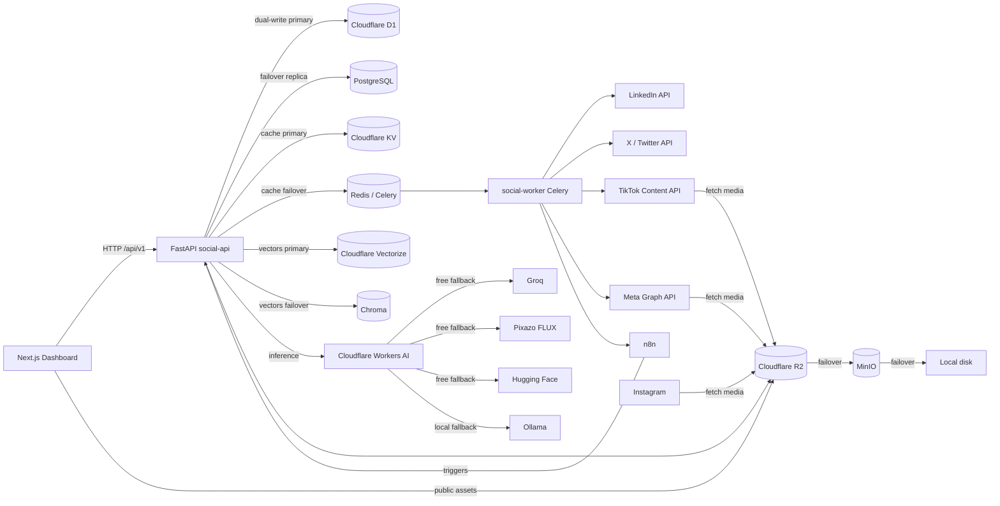

#### Database failover & dual-write router

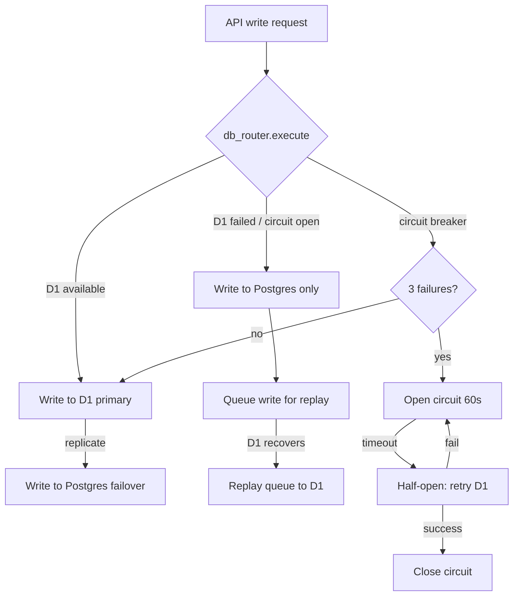

#### AI provider fallback chain (free first, Ollama last resort)

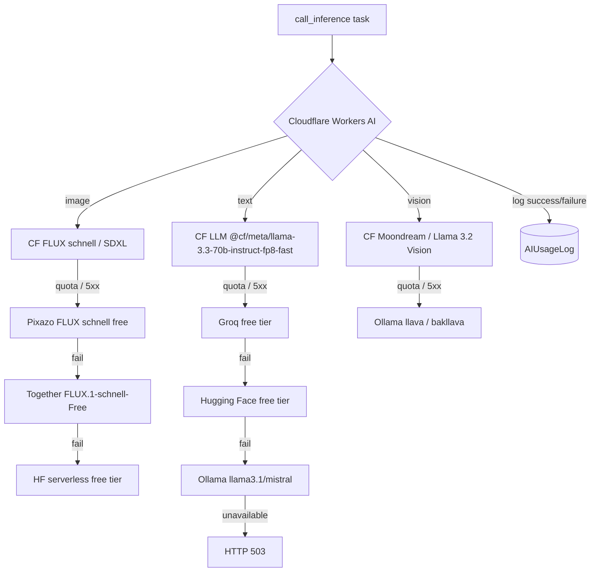

#### Storage fallback chain

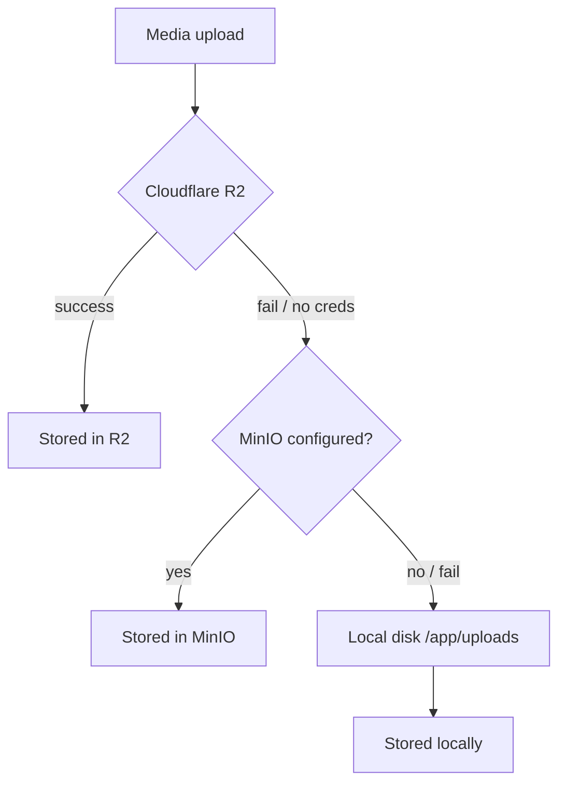

### 4.1 API contract cleanup
- Move all Pydantic request/response classes for LinkedIn to `app/schemas/linkedin.py` (or keep under `app/api/linkedin.py` if modules stay small).
- Standardize `PostResponse`, `QueueItemResponse`, and AI responses on snake_case, UUIDs as strings, and `created_at` ISO-8601.
- Add OpenAPI examples for `/ai/seo`, `/ai/analyze-content`, and `/linkedin/publish`.

### 4.2 Provider routing & fallback policy
- **Free-first, Cloudflare-first**: the default `call_inference` provider is `cloudflare` using free-tier models (`llama-3.3-70b-instruct-fp8-fast`, `flux-1-schnell`, `moondream3.1-9B-A2B`).
- Free fallbacks (key required but free tier): Groq (text), Pixazo (image), Hugging Face (text/image).
- **Ollama is the last resort** for text and vision when every cloud option fails or is unconfigured.
- Extend `AIProvider` model with `fallback_chain: list[str]`, `timeout_seconds: int`, `max_retries: int`, `daily_quota: int | None`.
- `call_inference` will read provider config from DB or env, attempt the primary, then iterate the fallback chain with exponential back-off.
- Cloudless carousel pipeline (`/ai/run-carousel-and-publish`) remains locked to `cloudflare` unless explicitly overridden by an admin flag.

### 4.3 Quotas, retries, and cost/neuron accounting

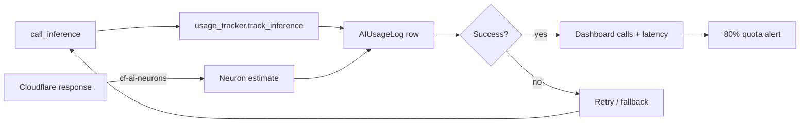

- Use `AIUsageLog` as the source of truth for:
  - Calls per provider/model/endpoint today.
  - Estimated tokens and neurons.
  - P95 latency per provider.
- Cloudflare response headers (`cf-ai-neurons`) parsed when present; otherwise estimate from prompt/output size.
- Alert thresholds: 80% daily quota, 3 consecutive failures, p95 latency >30s.

### 4.4 AI generation jobs & async status
- Convert long-running image/carousel generation to Celery tasks with progress metadata in Redis.
- Add `GET /ai/jobs/{job_id}` and `GET /ai/jobs` endpoints.
- Frontend polls or subscribes to a lightweight status feed.

### 4.5 Content validation
- `plain_english.py` runs automatically for every AI-generated caption, article, and comment.
- `seo.py` runs on demand and optionally on save.
- `duplicate_detector.py` scores similarity before media reuse.
- `media_spellcheck.py` spell/grammar-checks every media `alt_text`, `tags`, `ai_caption`, `generation_prompt`, `filename`, and collection `name` on upload, update, or AI generation.

### 4.6 LinkedIn reliability

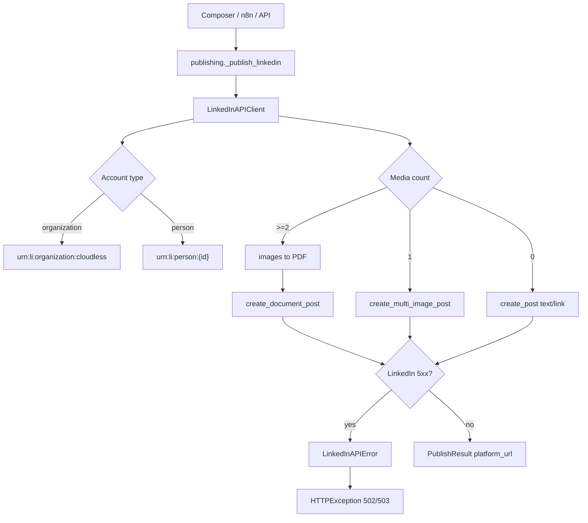

- `LinkedInAPIClient` is the single source of truth for all LinkedIn network calls.
- `publishing.py` author URN logic always defaults to `organization` for Company Pages.
- All media paths validated against `UPLOAD_DIR`; document URNs URL-encoded; media `source` kept ≤20 characters.

### 4.7 Multi-platform content adaptation

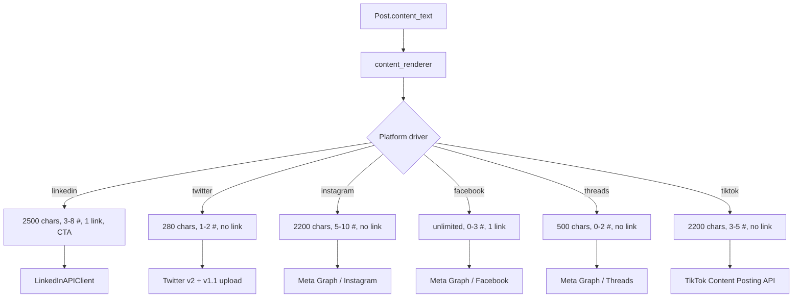

- New `app/services/platforms/` package with driver interfaces.
- `Post.content` stored once; per-platform rendering in `app/services/content_renderer.py`.

### 4.8 Media lifecycle

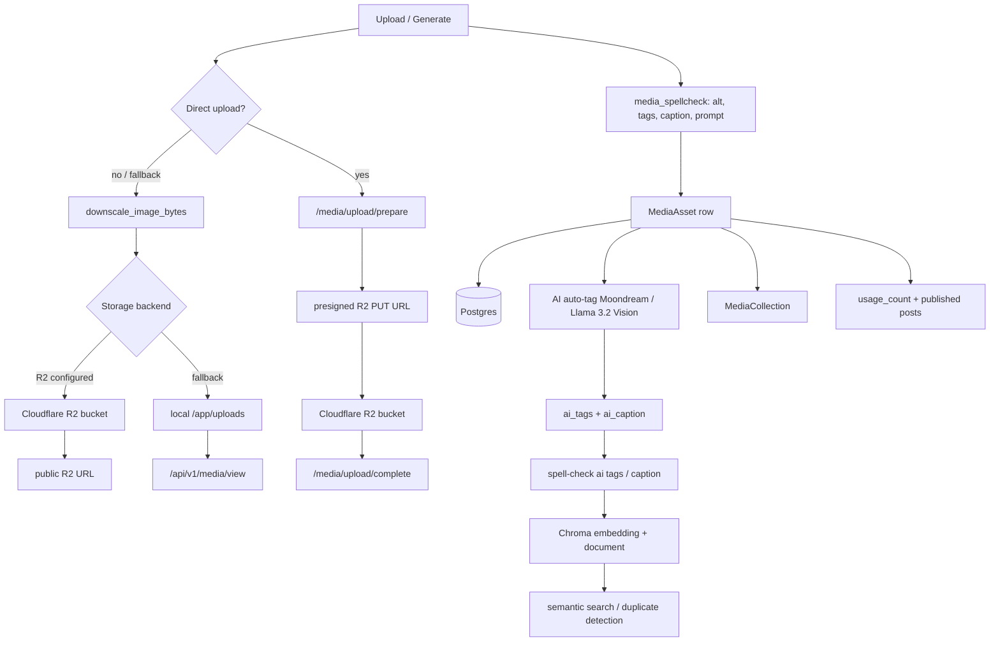

- Cloudflare R2 is the default, free storage target when `R2_BUCKET_NAME` and `R2_PUBLIC_URL` are configured; local disk remains a fallback. Free egress and 10 GB free storage.
- Direct browser upload via presigned R2 PUT URL (`POST /media/upload/prepare` → client PUT → `POST /media/upload/complete`) is available when `R2_ACCESS_KEY_ID` and `R2_SECRET_ACCESS_KEY` are set; otherwise the server-side `/upload` endpoint is used.
- `MediaAsset` tracks `storage_backend`, `public_url`, `ai_tags`, `ai_caption`, `embedding_id`, `is_favorite`, `is_archived`, `usage_count`, and `collection_id`.
- AI auto-tagging uses free Cloudflare vision models (`@cf/moondream/moondream3.1-9B-A2B` / `@cf/meta/llama-3.2-11b-vision-instruct`) with Ollama vision as last resort. Triggered automatically on upload/generation; can be re-run via `POST /media/assets/{id}/tag`.
- Every media text field (`alt_text`, `tags`, `ai_caption`, `generation_prompt`, `filename`) is spell/grammar-corrected via LanguageTool before it is stored or indexed.
- Chroma stores a textual description embedding for each asset, enabling keyword + semantic search and duplicate/similar-image discovery. Similar assets are exposed through `GET /media/assets/{id}/similar`.
- Cleanup job removes orphan R2 objects and local files older than 30 days.

### 4.9 Workflow execution & n8n

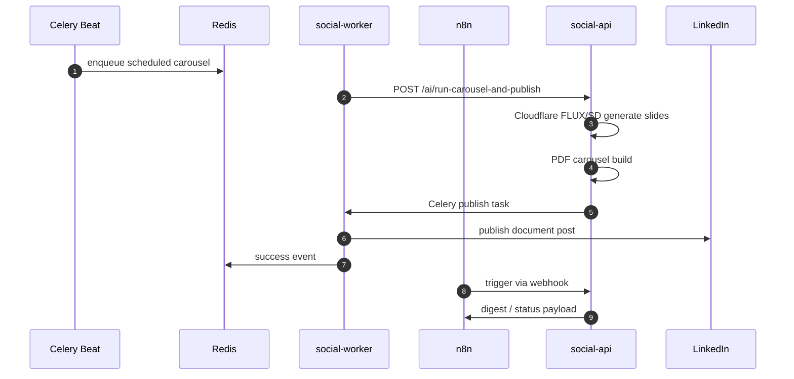

- Workflow JSON schema versioned in `n8n-workflows/`.
- Import/publish/restart script under `.devin/skills/n8n-cloudless/scripts/` preferred.
- Webhook payloads documented and stable.

### 4.10 Analytics sync & snapshots

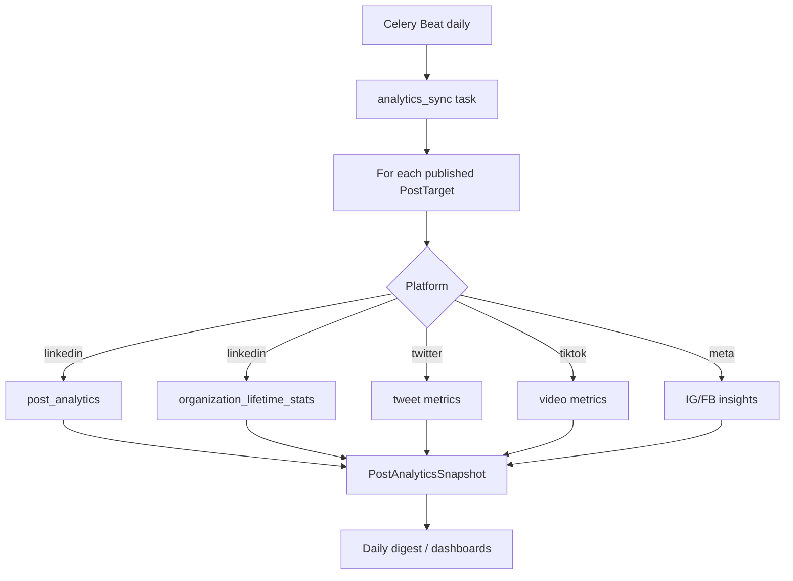

- `analytics_sync.py` pulls platform data per `PostTarget`.
- `PostAnalyticsSnapshot` appended every sync; `AnalyticsEvent` for granular events.
- Daily digest reads from snapshots.

### 4.11 Team/user authorization
- `Team`, `TeamMember`, `UserRole` extended with permissions.
- Row-level access checks in API endpoints via `get_current_user` + team lookup.

### 4.12 Auditability
- Add `app/services/audit.py` and `AuditLog` table.
- Log all publish, edit, delete, connect, and AI calls.

### 4.13 Cloudflare database failover & bidirectional sync

**Implemented.** Cloudflare D1, KV, and Vectorize serve as the primary databases for social-api, with local PostgreSQL, Redis, and ChromaDB as failover.

#### Components

| File | Purpose |
|------|---------|
| `app/services/d1_client.py` | Async D1 REST API client (query, insert, update, delete, count, table listing) |
| `app/services/kv_client.py` | Async KV client (get, put, delete, list_keys, health) |
| `app/services/vectorize_client.py` | Async Vectorize client (upsert, query, get, delete, health) |
| `app/services/db_sync.py` | Bidirectional sync service for all 15 application tables |
| `app/services/db_router.py` | Dual-write router with circuit breaker and replay queue |
| `app/api/cf_db.py` | API endpoints for health, sync, replay, and table inspection |
| `scripts/pg_to_d1.py` | PostgreSQL → D1/SQLite schema converter |

#### Cloudflare resources (free tier)

| Service | Name | ID env var |
|---------|------|-----------|
| D1 | social-automation | `D1_SOCIAL_AUTOMATION_ID` |
| D1 | n8n (backup) | `D1_N8N_ID` |
| D1 | metabase-analytics (backup) | `D1_METABASE_ID` |
| KV | social-cache | `KV_CACHE_NAMESPACE` |
| KV | social-queue | `KV_QUEUE_NAMESPACE` |
| Vectorize | social-embeddings | `VECTORIZE_INDEX_NAME` |

#### Dual-write router behavior

1. **Write**: D1 (primary) → Postgres (failover replica). If D1 fails, write to Postgres only and queue for replay.
2. **Read**: D1 (primary) → Postgres (failover on error).
3. **Circuit breaker**: Opens after 3 consecutive D1 failures. All traffic routes to Postgres for 60 seconds. Half-open state retries D1; success closes the circuit, failure reopens it.
4. **Replay queue**: Queued writes are replayed to D1 when the circuit closes. `POST /api/v1/cf-db/replay` triggers this manually.
5. **Bidirectional sync**: `POST /api/v1/cf-db/sync` syncs all 15 tables in both directions (Postgres→D1 then D1→Postgres).

#### Tables synced

`users`, `teams`, `team_members`, `social_accounts`, `posts`, `post_targets`, `media_assets`, `media_collections`, `publish_queue`, `ai_providers`, `ai_usage_logs`, `analytics_events`, `prompt_templates`, `generated_workflows`, `post_analytics_snapshots`.

#### SQL dialect conversion

The router converts SQLite/D1 syntax to PostgreSQL automatically:
- `INSERT OR REPLACE INTO t (cols) VALUES (?)` → `INSERT INTO t (cols) VALUES (?) ON CONFLICT (id) DO UPDATE SET ...`
- Boolean params (0/1 → True/False) for columns matching `is_*`, `success`
- ISO datetime strings → Python datetime objects for asyncpg

#### n8n and Metabase

n8n and Metabase require native PostgreSQL connections and cannot use D1 via REST API as their primary database. They keep PostgreSQL as primary. Their D1 databases (`D1_N8N_ID`, `D1_METABASE_ID`) are created and ready for periodic backup dumps.

#### API endpoints

| Endpoint | Method | Purpose |
|----------|--------|---------|
| `/api/v1/cf-db/health` | GET | D1, KV, Vectorize, router health |
| `/api/v1/cf-db/status` | GET | Router state (circuit, queue, mode) |
| `/api/v1/cf-db/sync` | POST | Trigger bidirectional sync |
| `/api/v1/cf-db/replay` | POST | Replay queued writes to D1 |
| `/api/v1/cf-db/tables` | GET | D1 table list with row counts |
| `/api/v1/cf-db/sync-tables` | GET | List tables configured for sync |

---

## 5. Frontend Architecture Plan

### 5.1 Dashboard improvements
- Live AI usage card (calls / neurons / estimated cost today).
- Queue health: scheduled, draft, failed, in-review counts.
- “Needs attention” list: failed posts, disconnected accounts, low SEO score.

### 5.2 Content ideation & calendar
- Ideation panel: pillar picker, trending topics, AI-generated briefs.
- Calendar v2: drag/drop, bulk actions, approval badges.

### 5.3 AI generation UX
- Show model/provider used and fallback trail.
- One-click regenerate, improve, shorten, expand.
- Preserve history of generations for each post.

### 5.4 Plain-English & SEO feedback

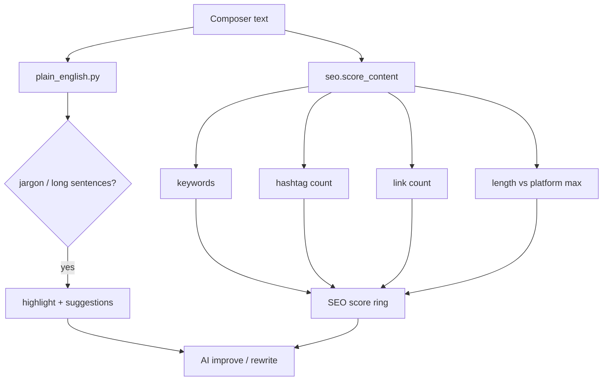

- Inline highlight of long sentences and jargon.
- SEO panel: score ring, keyword density, meta preview, UTM builder.

### 5.5 Carousel slide editor
- Add/remove/reorder slides; edit title/body/highlight per slide.
- Theme picker and live preview.

### 5.6 Approval/review

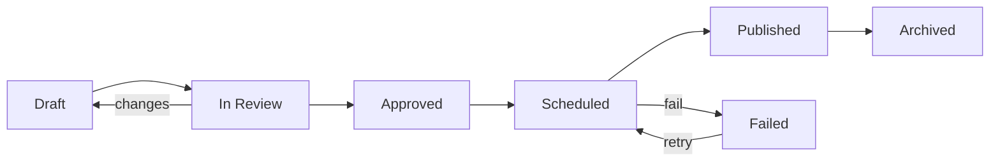

- Status badges and review comments.
- “Request changes / Approve / Reject” actions.

### 5.7 Publishing queue & retries
- Queue page: post, account, scheduled time, status, error, retry/cancel.
- Retry with exponential back-off and error detail drawer.

### 5.8 Connected-account health
- Account card shows token expiry, scopes, follower count, last sync.
- Company Page selector with `urn:li:organization:{id}` display.

### 5.9 Analytics drilldowns
- Post-level page with impressions/clicks/likes/comments/shares/follower growth.
- Platform comparison and top-post table.
- Date range, comparison mode, and CSV export.

### 5.10 Workflow templates & history
- Template gallery with one-click deploy.
- Execution history with status, logs, and failure details.

### 5.11 Media library

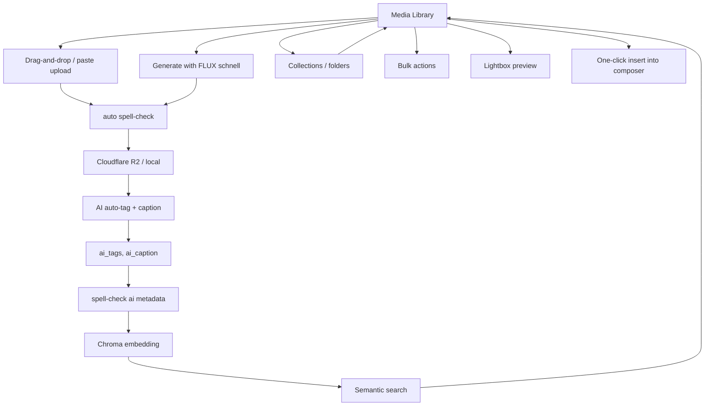

- Upload, generate, tag, alt-text, search, and reuse.
- Auto spell/grammar correction on `alt_text`, `tags`, `ai_caption`, `generation_prompt`, and collection names via LanguageTool.
- Duplicate/similar-image warning from Chroma.
- Collections, favorites, archives, and usage counters.
- Public R2 URL support for Instagram/TikTok/Twitter media posts.

### 5.12 Team & settings

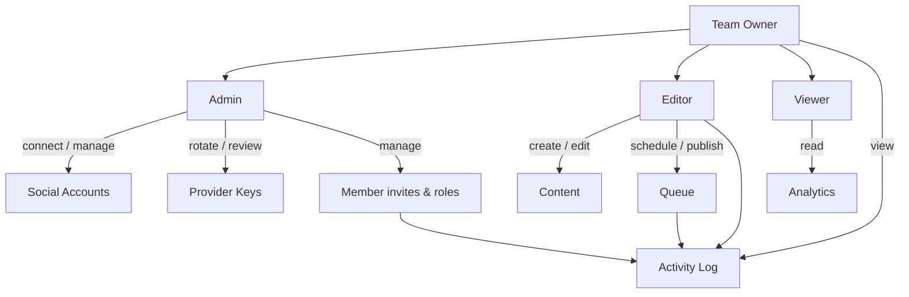

- Member invite, role assignment, and activity log.
- AI provider settings with quota and fallback configuration.

### 5.13 Responsive & accessible
- Mobile composer with collapsible previews.
- ARIA labels, focus traps, loading/empty/error states.

---

## 6. SEO Scope Definition

For SocialAuto, “SEO” means:

1. **Content-level SEO**
   - Keyword extraction and density.
   - Readability score and sentence-length analysis.
   - Hashtag/link count and platform-specific best practices.
   - Meta title/description suggestions for LinkedIn articles and blog posts.
2. **Discoverability**
   - Open Graph / link preview controls in composer.
   - UTM campaign builder and short-link tracking.
3. **Performance analytics (future)**
   - Track which posts and keywords drive profile/website visits.
   - Content-quality score over time.

Out of scope for this horizon: external SERP rank tracking, backlink building, or site-crawl SEO.

---

## 7. Testing & Acceptance Plan

### 7.1 Backend
- Unit tests for `linkedin_api.py`, `linkedin_ai.py`, `seo.py`, `plain_english.py`, `duplicate_detector.py`, `usage_tracker.py`.
- API endpoint tests for `app/api/linkedin.py`, `app/api/ai.py` (`/ai/seo`, `/ai/analyze-content`).
- Provider routing and fallback tests in `test_workers_ai.py`.
- Carousel pipeline tests with mocked Cloudflare image generation.
- Publishing and retry tests.
- Analytics aggregation/snapshot tests.
- Authz tests for team roles.

### 7.2 Frontend
- Vitest unit tests for `linkedinApi`, `useLinkedin*` hooks, and `LinkedInPage`.
- Playwright end-to-end: login → connect account → create LinkedIn post → publish (mocked if no real token).
- Component tests for SEO panel, queue, calendar.

### 7.3 Integration & ops
- n8n workflow import, publish, trigger validation.
- Container smoke tests (health endpoints, migrations, worker start).
- Manual dry-run with real credentials only after explicit authorization.

### 7.4 Quality gates
- `ruff check` clean.
- `mypy app` with `--ignore-missing-imports`.
- `pytest tests/unit` green.
- Trivy / CodeQL scans pass.

---

## 8. Deployment & Operational Constraints

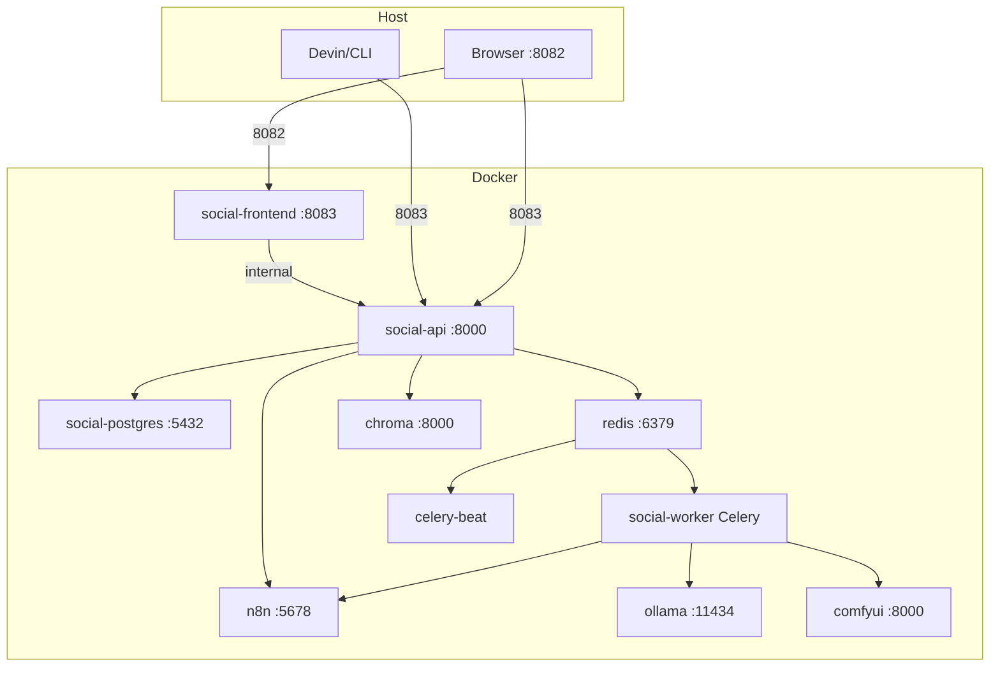

- All schema changes via Alembic; run `alembic upgrade head` on startup.
- Restart `social-worker` after any change to `app/services/publishing.py`, `app/services/linkedin_api.py`, or Celery tasks.
- Frontend changes require a rebuild of the `social-frontend` image or a dev container with `next dev`.
- n8n workflow changes require import, publish, and n8n restart for triggers to register.
- Cloudflare Workers AI free tier is 10,000 neurons/day shared; monitor `AIUsageLog` to avoid silent failures.
- LinkedIn Company Page publishing requires `w_organization_social` and `r_organization_social` scopes.

---

## 9. Dependencies & Migrations

### 9.1 New models / tables
- `AIUsageLog` (added as `d9a5a234d4d7_add_ai_usage_logs_table.py` in this branch).
- `AuditLog` (Phase 7).
- `PromptTemplate` extension for team-scoped templates (Phase 5).

### 9.2 API contract changes
- `AnalyzeContentResponse` gains `plain_english_issues` and `average_sentence_words`.
- New `POST /ai/seo` with `SeoRequest` / `SeoResponse`.
- `call_inference` gains optional `endpoint` keyword for usage tracking.

### 9.3 Environment variables
- Added to `.env.example`: `GROQ_API_KEY`, `TOGETHER_API_KEY`, `PIXAZO_API_KEY`, `OPENAI_API_KEY`, `HUGGINGFACE_API_KEY` (kept `HF_TOKEN` for ComfyUI/NIM where applicable).
- `CLOUDFLARE_API_TOKEN` / `CLOUDFLARE_ACCOUNT_ID` documented with free-tier notes.
- Cloudflare database env vars: `D1_SOCIAL_AUTOMATION_ID`, `D1_N8N_ID`, `D1_METABASE_ID`, `KV_CACHE_NAMESPACE`, `KV_QUEUE_NAMESPACE`, `VECTORIZE_INDEX_NAME`.
- `CLOUDFLARE_API_TOKEN` must have D1 Edit, Workers KV Storage Edit, Vectorize Edit, and R2 Edit permissions for the database failover system to work.

---

## 10. Risk Register

| Risk | Mitigation |
|------|------------|
| Cloudflare quota exhaustion mid-campaign | Fallback chain + quota dashboard + pre-schedule quota check. |
| LinkedIn API changes breaking URN / asset status logic | Centralized `LinkedInAPIClient` with versioned fallback paths. |
| `social-worker` not picking up publishing changes | Restart worker after deployment; add smoke test. |
| Frontend image not reflecting source changes | Rebuild `social-frontend` image or run dev container with mounted source. |
| n8n trigger not registering after workflow update | Always publish + restart n8n; validate with a manual webhook call. |
| Multi-tenant data leakage | Team-scoped queries in every endpoint; RBAC in Phase 7. |
| D1 free-tier write limit (100K/day) | Dual-write router queues excess writes to Postgres; replay when quota resets. |
| D1 outage | Circuit breaker opens after 3 failures, routes to Postgres. Replay queue syncs on recovery. |
| Bidirectional sync conflicts | Last-write-wins via `INSERT OR REPLACE` / `ON CONFLICT DO UPDATE`. Full sync runs on-demand. |
| KV free-tier write limit (1K/day) | Redis serves as local failover; KV is primary for cache only. |

---

## 11. Definition of Done for This Plan

- [ ] Megaplan reviewed and approved by user.
- [ ] Phase 0 code is merged and `pytest tests/unit` passes.
- [ ] `social-api` and `social-worker` containers healthy after restart.
- [ ] `AIUsageLog` table exists and is populated on inference calls.
- [ ] `/ai/seo` endpoint returns valid scores and meta suggestions.
- [ ] LinkedIn frontend page is reachable and functional after rebuild.
- [ ] `.env.example` is complete and consistent with `app/core/config.py`.

---

## 12. Major Implementation Testing & Release Gate

After every major implementation phase or feature merge, Devin must run and pass the full gate below before reporting the task as done. No feature is considered complete until all applicable aspects are verified.

### 12.1 Test-aspects flow

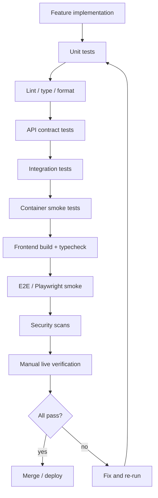

### 12.2 Mandatory verification checklist

| # | Aspect | What to run | Gate |
|---|--------|-------------|------|
| 1 | **Backend unit tests** | `pytest tests/unit -q` inside `social-api` | ≥ 95% of previous pass count, 0 new failures |
| 2 | **Targeted feature tests** | New or updated `test_*.py` for the changed module | All pass |
| 3 | **Lint & format** | `ruff check` and `ruff format --check` on changed files | Clean |
| 4 | **Type checking** | `mypy app --ignore-missing-imports` or `pyright` inside `social-api` | 0 new type errors |
| 5 | **API contract tests** | `pytest tests/integration` or manual `curl`/`httpx` against `/docs` + changed endpoints | Schemas match, 2xx/4xx as expected |
| 6 | **Migrations** | `alembic upgrade head` and `alembic downgrade -1` then `upgrade head` again | No migration errors |
| 7 | **Container smoke tests** | `docker compose ps` healthy; `curl /health`; worker `celery inspect ping` | All green |
| 8 | **Frontend typecheck** | `tsc --noEmit` or `next build` in a Node container with source mounted | 0 TS errors |
| 9 | **Frontend build** | `next build` or `pnpm build` inside a Node container | Build succeeds |
| 10 | **E2E smoke** | Playwright: login → navigate to feature → basic happy path | Passes |
| 11 | **Security scans** | `trivy filesystem .` and CodeQL SAST | No new high/critical findings |
| 12 | **Live endpoint verification** | Hit the changed endpoint(s) with real or mocked credentials, inspect DB side effects | Output matches spec, no 500s |
| 13 | **Worker behavior** | Trigger a Celery task that exercises changed code; tail logs | Completes without errors |
| 14 | **n8n / workflow validation** | Import, publish, and trigger workflow if it touches n8n | Webhook fires, run succeeds |
| 15 | **.env consistency** | Diff `.env.example` against `app/core/config.py` | Every config var has an example entry |
| 16 | **Secrets hygiene** | `git diff --check`; grep for keys/tokens in diff | No secrets committed |
| 17 | **Docs / plan update** | Update `AGENTS.md`, `.devin/plans/`, or inline README if behavior changed | Docs reflect reality |

### 12.3 Container restart rules

After any change to these paths, the matching container must be restarted and health-checked:

- `app/services/publishing.py`, `app/services/linkedin_api.py`, Celery tasks → `social-worker`
- `app/api/*.py`, `app/services/*.py` with new endpoints or imports → `social-api`
- `frontend/**` → rebuild `social-frontend` or restart dev container
- `n8n-workflows/**` or webhook nodes → import, publish, restart `n8n`

### 12.4 Definition of done for any major feature

A feature is not "done" until:

- [ ] All 17 applicable checks above are documented in the session summary.
- [ ] The user is told exactly which commands were run and the results.
- [ ] Any failing gate is fixed or escalated with a concrete next step.
- [ ] The git working tree is clean or the uncommitted changes are explicitly described.
- [ ] The plan file (this file) is updated if the scope changed.

---

*Generated with [Devin](https://devin.ai)*
