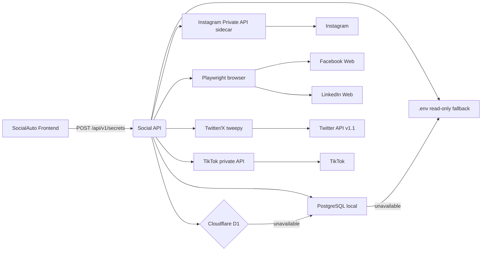
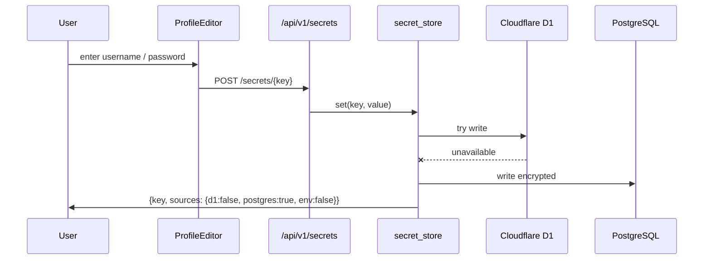
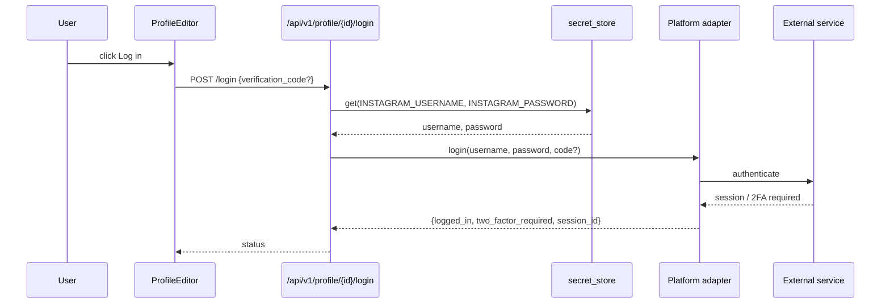

# Social Profile Secrets & App-Mediated Login

## Goal

Store all social platform credentials in a Cloudflare-first secret store so
SocialAuto can log in and update profiles without requiring manual `.env`
editing. Provide local PostgreSQL and `.env` failover, encrypted-at-rest
storage, and platform-specific login paths for Instagram, Facebook, LinkedIn,
Twitter/X, and TikTok.

## Architecture



## Credential write flow



## Login flow



## Secret store fallback chain

| Store | Role | Write | Read fallback |
|-------|------|-------|---------------|
| Cloudflare D1 | Primary | Yes | First |
| PostgreSQL | Local failover | Yes (when D1 down) | Second |
| `.env` | Static fallback | No (read-only) | Third |

## Per-account credentials

Global keys (e.g. `INSTAGRAM_USERNAME`) can be overridden with per-account keys:

```text
INSTAGRAM_USERNAME_{account_id}
INSTAGRAM_PASSWORD_{account_id}
FACEBOOK_USERNAME_{account_id}
FACEBOOK_PASSWORD_{account_id}
LINKEDIN_USERNAME_{account_id}
LINKEDIN_PASSWORD_{account_id}
```

## Supported secret keys

| Key | Used for | Provider |
|-----|----------|----------|
| `INSTAGRAM_USERNAME` / `INSTAGRAM_PASSWORD` | `aiograpi-rest` login | Instagram private API |
| `INSTAGRAM_PROXY` | optional mobile/residential proxy | Instagram private API |
| `FACEBOOK_USERNAME` / `FACEBOOK_PASSWORD` | Playwright login | Facebook web |
| `LINKEDIN_USERNAME` / `LINKEDIN_PASSWORD` | Playwright login | LinkedIn web |
| `TWITTER_API_KEY` / `TWITTER_API_SECRET` | `tweepy` v1.1 | Twitter/X API |
| `TWITTER_ACCESS_TOKEN` / `TWITTER_ACCESS_TOKEN_SECRET` | `tweepy` v1.1 | Twitter/X API |
| `TIKTOK_PRIVATE_API_KEY` | signing server | TikTok private API |

## Security notes

- Values are encrypted at rest with `ENCRYPTION_KEY` before writing to D1 or Postgres.
- List/get raw responses require authentication. List responses mask values as `***`.
- `hide_parameters=True` on the SQLAlchemy engine prevents secret values from appearing in DB logs.
- `.env` is read-only from the `social-api` container; writes go through the API.

## Operational scripts

```bash
# List all secret keys (values masked)
.devin/skills/social-profile-secrets/scripts/list-secrets.sh

# Save platform credentials
.devin/skills/social-profile-secrets/scripts/set-instagram.sh <username> <password>
.devin/skills/social-profile-secrets/scripts/set-facebook.sh <email> <password>
.devin/skills/social-profile-secrets/scripts/set-linkedin.sh <email> <password>
.devin/skills/social-profile-secrets/scripts/set-twitter.sh <key> <secret> <token> <token_secret>
.devin/skills/social-profile-secrets/scripts/set-tiktok.sh <api_key>

# Log in to a connected account
.devin/skills/socialauto-profile/scripts/login.sh <account-id> [2fa-code]

# List connected account IDs
.devin/skills/socialauto-accounts/scripts/list-accounts.sh
```

## Platform login requirements

| Platform | Credentials | 2FA/challenge | Notes |
|----------|-------------|---------------|-------|
| Instagram | username, password | SMS/email/TOTP | Often needs a residential/mobile proxy to avoid `challenge_required` |
| Facebook | email/phone, password | SMS/email/approvals | Headless browser may need proxy and correct cookie consent handling |
| LinkedIn | email/phone, password | SMS/email | Headless browser may be blocked by bot detection; proxy recommended |
| Twitter/X | API v1.1 key/secret + tokens | - | Requires paid Basic/Pro tier for profile writes |
| TikTok | private API signing key | - | Username/password not currently used; signing key is required |
